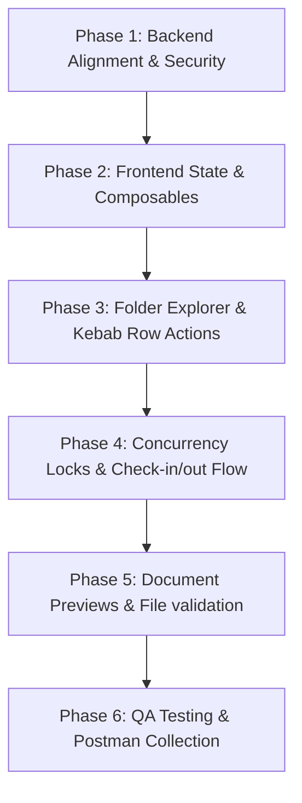

# Feature Context: Document Management (CMS)

Full implementation plan for the Document Management (CMS) module under the multi-tenant Enterprise ERP architecture, covering backend standard alignment and frontend creation.

## Implementation Phases

### Phase 1: Backend Alignment & Security (P0/P1)
- **Permissions & Seeders**:
  - Implement `CmsPermissionSeeder.php` covering admin actions (`documents.storage.*`, `documents.versioning.*`, `documents.workflows.*`) and `.self` scopes.
  - Register the seeder in `TenantDatabaseSeeder.php` to automate tenant onboarding setup.
- **Access Policies**:
  - Implement `CmsDocumentPolicy.php` and `CmsFolderPolicy.php` enforcing standard gates.
- **CamelCase REST Resources**:
  - Refactor `CmsDocumentResource.php`, `CmsDocumentVersionResource.php`, and `CmsFolderResource.php` from legacy snake_case output to strict camelCase response contracts (e.g. `cmsFolderId`, `lockedBy`, `lockedAt`, `versionNumber`, `sizeBytes`, `changeSummary`, `uploadedBy`).
- **Sidebar Entitlement Routing**:
  - Ensure the sidebar matches the registered CMS routes.

### Phase 2: Frontend State & Composables (P2)
- **API Composables**:
  - Implement `frontend/composables/useCmsDocuments.ts` routing strictly through `useApi()` to auto-inject the `X-Tenant-Handle` and `Authorization` headers.
- **Global Store**:
  - Add flat state management `frontend/stores/documents.ts` for folder tree navigation state, check-out file locks, and dynamic upload queuing.

### Phase 3: Folder Explorer & Kebab Row Actions (P1/P2)
- **Folder List UI (`/documents/index.vue`)**:
  - Premium Responsive Grid/DataTable using existing design tokens (`.glass-card`, `--color-primary-rgb`).
  - PrimeVue Tree and Breadcrumb controls to browse directories.
- **Row Action Controls**:
  - Collapse table row actions into a 30x30 kebab button (`ti-dots-vertical`) with fixed dropdown positioning and click-outside dismiss listeners.
- **Confirmations & Modals**:
  - Re-route delete, locks, and file uploads to `useToast().confirm()`.

### Phase 4: Concurrency Locks & Check-in/out Flow (P0/P1)
- **Locking Actions**:
  - Wire checkout locks to lock files to single users.
  - Support check-in overlays allowing users to drop new files and record change summaries.

### Phase 5: Document Previews & File validation (P1/P2)
- **Document Previews**:
  - Implement dynamic preview screens (PDF, images, document types) inside standard modal templates, loaded inside `onMounted` to protect against SSR mismatches.
- **Upload Validation**:
  - Validate uploads server-side for banned extensions (`.php`, `.py`, `.exe`) and MIME magic bytes.

### Phase 6: QA Testing & Postman Collection (P0/P1)
- **Tenancy Isolation Tests**:
  - Add Pest feature tests verifying Tenant A is blocked from reading or writing Tenant B's folders and files.
- **Concurrency & Lock Tests**:
  - Write tests verifying checking in locked files by other users fails with 409 Conflict.
- **Contract & Audit Tests**:
  - Verify camelCase structures, pagination envelope shape, and `Auditable` database trail logging.
- **Postman Sync**:
  - Synchronize CMS Document endpoints with `docs/postman/erp_collection.json`.
