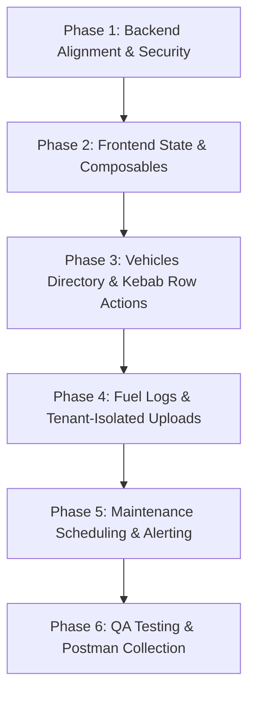

# Feature Context: Fleet Management

Full implementation plan for the Fleet Management module under the multi-tenant Enterprise ERP architecture, covering backend standard alignment and frontend creation.

## Implementation Phases

### Phase 1: Backend Alignment & Security (P0/P1)
- **Permissions & Seeders**:
  - Implement `FleetPermissionSeeder.php` covering admin actions (`fleet.vehicles.*`, `fleet.maintenance.*`, `fleet.fuel.*`) and `.self` scopes.
  - Register the seeder in `TenantDatabaseSeeder.php` to automate tenant onboarding setup.
- **Access Policies**:
  - Implement `VehiclePolicy.php`, `MaintenanceLogPolicy.php`, and `FuelLogPolicy.php` enforcing standard gates.
- **CamelCase REST Resources**:
  - Refactor `VehicleResource.php`, `MaintenanceLogResource.php`, and `FuelLogResource.php` from legacy snake_case output to strict camelCase response contracts (e.g. `registrationNumber`, `currentMileage`).
- **Sidebar Entitlement Routing**:
  - Update `ModuleSeeder.php` to bind `'fleets'` to the active `/fleet/vehicles` Nuxt route (instead of `'#'`).

### Phase 2: Frontend State & Composables (P2)
- **API Composables**:
  - Implement `frontend/composables/useFleet.ts` routing strictly through `useApi()` to auto-inject the `X-Tenant-Handle` and `Authorization` headers.
- **Global Store**:
  - Add flat state management `frontend/stores/fleet.ts` for tracking active vehicles and real-time telemetry coordinates.

### Phase 3: Vehicles Directory & Kebab Row Actions (P1/P2)
- **Vehicles List UI (`/fleet/vehicles.vue`)**:
  - Premium Responsive Grid/DataTable using existing design tokens (`.glass-card`, `--color-primary-rgb`).
  - Integrate interactive maps dynamically in `onMounted` lifecycle hooks.
- **Row Action Controls**:
  - Collapse table row actions into a 30x30 kebab button (`ti-dots-vertical`) with fixed dropdowns and click-outside dismiss listeners.
- **Confirmations & Modals**:
  - Re-route delete, edit, and state changes to `useToast().confirm()`.

### Phase 4: Fuel Logs & Tenant-Isolated Uploads (P1/P2)
- **Fuel Logs Table (`/fleet/fuel.vue`)**:
  - Render list using `formatDate` from `~/composables/useDateFormat.ts`.
- **Tenant-Isolated Receipt Uploading**:
  - Integrate image attachments (fuel receipts) using the tenant-scoped filesystem (`tenant_path()`). 
  - Restrict exposure using signed, temporary URLs.

### Phase 5: Maintenance Scheduling & Alerting (P1/P2)
- **Maintenance Table (`/fleet/maintenance.vue`)**:
  - Display maintenance logs with active status indicators.
- **Job Triggers**:
  - Ensure the `MaintenanceSchedulerJob` triggers alert checks against configured vehicle thresholds.

### Phase 6: QA Testing & Postman Collection (P0/P1)
- **Tenancy Isolation Tests**:
  - Add Pest feature tests verifying Tenant A is blocked from reading or writing Tenant B's fleet records.
- **Business Invariant Tests**:
  - Write tests verifying mileage is monotonic and cannot decrease.
- **Contract & Audit Tests**:
  - Verify camelCase structures, pagination envelope shape, and `Auditable` database trail logging.
- **Postman Sync**:
  - Synchronize Fleet endpoints with `docs/postman/erp_collection.json`.
