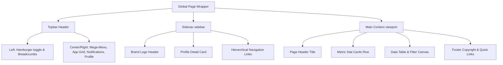

# Enterprise ERP Design Specification

This design specification is derived from a meticulous analysis of the **Paces - Multipurpose Tailwind CSS & Bootstrap Admin Dashboard Template** by Coderthemes. It maps the visual standards, color tokens, layout hierarchy, and component interfaces to our high-performance, decoupled Multi-Tenant Enterprise ERP system (Nuxt 3+, Tailwind CSS 4+, and PrimeVue).

---

## 1. Core Visual Philosophy
Our design standards reflect **"Operational Clarity, High Density, and Premium Aesthetics."** The ERP balances data-rich density (critical for accounting, payroll, and stock management) with modern UI elegance:
*   **Harmonious Accents:** A dynamic palette of sub-brand colors based on modern HSL tokens.
*   **Depth & Glassmorphic Surfaces:** Extensive use of background filters, soft backdrops (`backdrop-blur-md`), and layered card shadows.
*   **Tactile Feedback:** Gentle hover expansions (`scale-102`), soft shadow shifts, and dynamic border transitions.
*   **High-Density Focus:** Standard layouts feature clean, structural grids, optimized vertical padding, and a dark-mode first design to minimize screen fatigue.

---

## 2. Global Styling & Color System
The color scheme is designed to scale dynamically for multi-tenant setups, mapping colors to responsive CSS variables (`--color-primary`, `--color-secondary`, etc.).

### 2.1 Theme Palette Matrix
| Color Variable | Hex Code / Tailwind Equivalent | Role & Application |
| :--- | :--- | :--- |
| **Primary (Electric Indigo)** | `#3b82f6` / `blue-500` | Accent color, buttons, active menu states, main icons |
| **Primary Subtle** | `rgba(59, 130, 246, 0.1)` | Badges, hover states, card backdrops |
| **Secondary (Cool Gray)** | `#64748b` / `slate-500` | Subtitle text, inactive borders, secondary badges |
| **Secondary Subtle** | `rgba(100, 116, 139, 0.1)` | Grid borders, secondary card widgets |
| **Success (Emerald Green)** | `#10b981` / `emerald-500` | Active listings, positive metrics, published states |
| **Success Subtle** | `rgba(16, 185, 129, 0.1)` | Soft success badges, trending indicators |
| **Warning (Amber Orange)** | `#f59e0b` / `amber-500` | Pending states, critical stock alerts, rating stars |
| **Warning Subtle** | `rgba(245, 158, 11, 0.1)` | Pending badges, soft warnings |
| **Danger (Crimson Red)** | `#ef4444` / `red-500` | Out of stock states, negative trend metrics, delete actions |
| **Danger Subtle** | `rgba(239, 68, 68, 0.1)` | Out of stock badges, destructive buttons |
| **Info (Sky Blue)** | `#0ea5e9` / `sky-500` | Dynamic counts, customer tracking, help tips |
| **Info Subtle** | `rgba(14, 165, 233, 0.1)` | Soft info badges, customer avatars |

### 2.2 Surface Elevation & Mode Styling
```css
/* Base Surface Variables */
:root {
  /* Light Mode Surface */
  --bg-layout: #f8fafc;        /* Slate 50 */
  --bg-card: #ffffff;
  --border-color: #e2e8f0;    /* Slate 200 */
  --text-heading: #0f172a;    /* Slate 900 */
  --text-body: #475569;       /* Slate 600 */
  --shadow-sm: 0 1px 2px 0 rgba(0, 0, 0, 0.05);
  --shadow-md: 0 4px 6px -1px rgba(0, 0, 0, 0.1), 0 2px 4px -2px rgba(0, 0, 0, 0.1);
}

[data-bs-theme="dark"] {
  /* Dark Mode Surface */
  --bg-layout: #0b0f19;       /* Ultra-deep obsidian navy */
  --bg-card: #121824;         /* Rich Slate 900 surface */
  --border-color: #1e293b;    /* Slate 800 */
  --text-heading: #f8fafc;    /* Slate 50 */
  --text-body: #94a3b8;       /* Slate 400 */
  --shadow-sm: 0 1px 2px 0 rgba(0, 0, 0, 0.5);
  --shadow-md: 0 10px 15px -3px rgba(0, 0, 0, 0.3), 0 4px 6px -4px rgba(0, 0, 0, 0.3);
}
```

---

## 3. Typographical Hierarchy
We utilize **Outfit** for modern high-contrast titles and **Inter** for robust, highly-legible interface layout:
*   **Headers & Titles (Outfit):**
    *   Page Main Titles: `H4` / `1.125rem` (`18px`), Font Weight `600` (Semibold), leading-tight.
    *   Section Subtitles / Card Headers: `H5` / `0.9375rem` (`15px`), Font Weight `500` (Medium).
*   **Body & UI Metadata (Inter):**
    *   Standard Text: `body-sm` / `0.875rem` (`14px`), Font Weight `400` (Regular).
    *   Sub-labels / Brand Names: `text-xs` / `0.75rem` (`12px`), Font Weight `400`.
    *   Badges / Sorting Caps: `text-xxs` / `0.6875rem` (`11px`), Font Weight `600`, Uppercase, tracking-wider.
*   **Monospace Figures (JetBrains Mono):**
    *   Applied to stock codes (SKU), currency amounts, counts, and date timestamps (`text-sm`, `tracking-tight`).

---

## 4. Main Shell Structure & Layout Components



### 4.1 Topbar Header Details
A high-density top interface stretching 100% width with a soft border separator (`border-bottom`). It contains:
1.  **Sidebar Toggle:** A floating circular action icon using Lucide `ti-menu-2` / `ti-menu-4` to expand/collapse the sidenav dynamically.
2.  **Mega Menu Dropdown:** An expandable visual board category index:
    *   **Categories:** Dashboards & Analytics, Project Management, User Management.
    *   **Banner Widget:** A colorful graphic panel highlighting active user session features ("Welcome Back David", upgrade prompt, premium themes).
3.  **Apps Grid (9-Grid Selector):** Dropdown menu with soft rounded logos representing quick integrations (Figma, GitHub, Slack, Dropbox, etc.).
4.  **Instant Theme Toggle:** Toggles system light/dark/system mode dynamically, rendering immediate SVG asset swaps.
5.  **Notifications Hub:** Badged bell icon displaying "+7 New". Shows grouped user notifications with interactive media avatars (e.g. comment details, build statuses).
6.  **Monochrome Control & Language Selector:** Custom country flag switches supporting English, Spanish, German, French, Italian, and Chinese.
7.  **Profile Center Dropdown:** Displays user avatar with green online status marker. Exposes:
    *   *My Profile, Chat Messages, Account Settings, Support FAQ, Lock Screen, Sign Out.*

### 4.2 Sidebar Sidenav Menu Details
A fixed-width sidebar spanning `260px` in standard desktop view, collapsing to a minimized icon-only state (`70px`).
*   **Dynamic Brand Logos:** Contains double brand representations (automatic switches for dark/light layouts).
*   **Sidenav Profile Card:** Inline visual component containing a rounded user portrait, name, and subtitle role details ("David Dev", "Art Director"), facilitating rapid identity confirmation.
*   **Navigational Groups:**
    *   *Main:* Dashboards (Ecommerce, Analytics, CRM, Finance, Projects).
    *   *Apps:* Decoupled operational modules including **Ecommerce** (Products, Grid, Orders, Inventory, Refunds, Reviews), CRM, Tasks, Invoices, HRM, and Support Center.
    *   *Base Elements:* Hierarchical indices for components (Modals, Grids, Alerts), Forms (Validation, Wizards, Editors), and custom advanced tables.

---

## 5. Feature View: Product Management Canvas
This primary modular workspace leverages structural grids to layout critical e-commerce inventories.

### 5.1 Quick Metrics Row (5-Column Responsive Grid)
Five highly-scannable card components layout key system metrics:
1.  **Products Card (Primary subtle):** Total product count `2,240` (Active Listings: `980`). Dynamic badge `+24 New` (Success color). Accent circle containing `ti-package`.
2.  **Orders Card (Secondary subtle):** Customer order metric `8,014` (Total Orders: `105K`). Badge `+120 New`. Accent circle containing `ti-shopping-cart`.
3.  **Sales Card (Success subtle):** Today's revenue calculation `$17,854.22` (Today's Sales: `$156K`). Badge `+8.2%`. Accent circle containing `ti-currency-dollar`.
4.  **Customers Card (Info subtle):** Active client count `3,209` (Total Customers: `58,320`). Badge `+36 New`. Accent circle containing `ti-users`.
5.  **Revenue Card (Warning subtle):** Total gross margins `$3.50M` (Total Revenue: `$12.8M`). Badge `-4.5%` (Danger badge style). Accent circle containing `ti-chart-bar`.

### 5.2 Filter, Search & Actions Toolbar
A horizontal toolbar panel allowing seamless inventory control:
*   **Search Box:** Embedded prefix icon search input ("Search product name...").
*   **Multi-Filter Matrix:** Three clean inline select drop-downs:
    *   *Category Filter:* Incorporates tag icon (`ti-tag`). Exposes Electronics, Fashion, Home, Sports, Beauty.
    *   *Status Filter:* Incorporates activity icon (`ti-activity`). Exposes Published, Pending, Out of Stock.
    *   *Price Range Filter:* Incorporates currency icon (`ti-currency-dollar`). Exposes $0-$50, $51-$150, $151-$500, $500+.
*   **View Toggle:** Dual icon toggle button (Grid Category vs List Check representation).
*   **Primary Action Button:** Standalone bold red button (`btn-danger`) incorporating `ti-plus` for instant operational redirects ("Add Product").

### 5.3 High-Density Inventory Data Table
A modern, structural borderless list designed with absolute alignment:
*   **Header Sorting:** Standard metadata categories containing tiny SVGs indicating ascend/descend click status.
*   **Check-box Control:** High contrast border selector mapping dynamic selection parameters.
*   **Product Visual Avatar:** A detailed multi-item cell containing:
    *   A clean, rounded asset preview box (`48px` x `48px`).
    *   Bold product title (`text-heading`, link styled).
    *   A secondary subtitle detailing the supplier/vendor ("by: Brand name").
*   **Operational Columns:** Includes SKU, Category tags, clean numeric figures for Stock and Pricing, and interactive star graphics representing total customer ratings.
*   **Badges:** Uses curved, desaturated soft elements (`badge-soft-*` in light mode, high contrast solid in dark mode).
*   **Row Interactions:** Hover states apply transparent backdrops (`bg-slate-500/5`), softening active columns.
*   **Action Drawer:** Minimalist icons providing instant redirects: View (Eye), Edit (Pencil), and Delete (Trash).

---

## 6. Advanced Customizer Canvas (Offcanvas Menu)
A dynamic drawer sliding from the screen right margin allowing quick, custom client overrides:
1.  **Skin Selectors (24 custom theme cards):** Render visual configurations adjusting overall visual schemes (Prism, Minimalist, Vivid, Retro, Neon, Oblique, etc.).
2.  **Color Scheme Schemes:** Enforces light/dark overrides or aligns settings to the system layout.
3.  **Topbar & Sidenav Color Tuning:** Sets navbar properties to Light, Dark, Gray, or customizable color gradients.

---

## 7. Frontend Decoupled Nuxt/PrimeVue Integration
To keep this theme pixel-perfect in our Vue 3 + TypeScript architecture, follow these rules:

1.  **Tailwind Utility Standards:**
    *   Use Tailwind CSS `@apply` patterns within single-file components.
    *   Prefer Tailwind standard variables over hardcoded colors to maintain multi-tenant dynamically injected branding:
        ```html
        <!-- Example Badge Component -->
        <span class="inline-flex items-center gap-1.5 px-2 py-1 text-xxs font-semibold rounded bg-success-subtle text-success">
          <i class="ti ti-circle-filled text-[6px]"></i>
          Published
        </span>
        ```
2.  **PrimeVue Component Mapping:**
    *   Map the Product list Table to PrimeVue's `<DataTable>` with styling overrides using `pt` (Pass Through) properties.
    *   Replace standard form elements with PrimeVue's `<InputText>`, `<Select>` (Dropdown), and `<Button>` styled matching Paces visual specification.
3.  **Dynamic Sidenav Configurations:**
    *   Render the navigational drawer dynamically utilizing Pinia configuration matrices to support multi-tenant modular capability mapping.

---

## 8. SEO Meta Configurations
For index-facing pages (public tenant landing panels, product detail displays):
*   **Meta Framework:** Injected via Nuxt `useHead`:
    ```typescript
    useHead({
      title: 'Enterprise ERP - Product Catalog Manager',
      meta: [
        { name: 'description', content: 'Configure, audit, and analyze your multi-tenant enterprise inventory with full security, database isolation, and detailed operational tracking.' }
      ]
    })
    ```
*   **Heading Structure:** Enforced single `<h1>` tag inside page scopes to optimize search crawler indexing index layouts.

---

## 9. Modular Tasks Canvas Design & Animation Concept (CSS Only)

To reflect the highly premium visual aesthetic found in senior frontend development styles, the **Tasks Module** in our Multi-Tenant ERP utilizes a pure-CSS animation and color framework. This ensures smooth, GPU-accelerated micro-animations without external JS package bloat.

### 9.1 GPU-Accelerated Animation Tokens
Integrate these custom animation keyframes and properties in `frontend/assets/css/main.css` to drive high-performance task metrics, urgent alerts, and interactive states:

```css
/* Next-Gen CSS Animation Keyframes for Tasks UI */
@layer base {
  @theme inline {
    --animate-orbit: orbit var(--duration, 10s) linear infinite;
    --animate-meteor: meteor var(--duration, 5s) linear infinite;
    --animate-ripple: ripple var(--duration, 2s) ease calc(var(--i, 0) * 0.2s) infinite;
  }

  /* 1. Orbit Effect: Circular task completion loaders & chart tracks */
  @keyframes orbit {
    0% {
      transform: rotate(calc(var(--angle) * 1deg)) translateY(calc(var(--radius) * 1px)) rotate(calc(var(--angle) * -1deg));
    }
    100% {
      transform: rotate(calc(var(--angle) * 1deg + 360deg)) translateY(calc(var(--radius) * 1px)) rotate(calc((var(--angle) * -1deg) - 360deg));
    }
  }

  /* 2. Meteor Glow: Floating streak gradients inside urgent task category cards */
  @keyframes meteor {
    0% {
      transform: rotate(var(--angle)) translateX(0);
      opacity: 1;
    }
    70% {
      opacity: 1;
    }
    100% {
      transform: rotate(var(--angle)) translateX(-500px);
      opacity: 0;
    }
  }

  /* 3. Ripple Pulse: Tactile indicator dots for Overdue or High-Priority Tasks */
  @keyframes ripple {
    0%, 100% {
      transform: translate(-50%, -50%) scale(1);
    }
    50% {
      transform: translate(-50%, -50%) scale(0.9);
    }
  }
}
```

### 9.2 Tasks Visual Layout Classes
*   **High-Priority Overdue Ripple Indicator**:
    ```html
    <div class="relative w-4 h-4 flex items-center justify-center">
      <span class="absolute w-full h-full rounded-full bg-red-500/20 animate-ripple" style="--duration: 1.5s; --i: 1;"></span>
      <span class="absolute w-2 h-2 rounded-full bg-red-500"></span>
    </div>
    ```
*   **Active Orbit Loading States**:
    ```html
    <div class="relative w-12 h-12 rounded-full border border-violet-500/10 flex items-center justify-center">
      <span class="absolute animate-orbit text-violet-400" style="--angle: 0; --radius: 20;">⚡</span>
      <span class="text-xxs font-bold text-gradient">78%</span>
    </div>
    ```
*   **Premium Meteor-Background Card**:
    ```html
    <div class="relative overflow-hidden p-5 rounded-xl border border-(--border-color) bg-(--bg-secondary)/80 backdrop-blur-md">
      <!-- Floating Meteor Effect -->
      <span class="absolute top-0 right-0 h-[2px] w-[100px] bg-linear-to-r from-violet-500 to-transparent animate-meteor" style="--angle: -45deg; --duration: 3s;"></span>

      <h3 class="text-xs font-bold text-(--text-primary)">Critical Release Sprint</h3>
      <p class="text-[10px] text-(--text-secondary) mt-1">Due today at 18:00</p>
    </div>
    ```

---

## 10. Feature View: Recruitment Candidate Pipeline (Kanban Concept)

The HRM recruitment workspace renders applicants as a horizontal pipeline — one column per `ApplicationStatus`, with drag-and-drop status transitions. Reference implementation: `frontend/pages/candidates.vue`. This canvas is the canonical pattern for any future stage-based workspace (e.g. Sales O2C pipeline, Procurement RFQ board, Tasks Sprint board) — reuse the column shell, card anatomy, and signal-derivation rules below rather than reinventing them.

### 10.1 Visual Token Mapping
The original concept was authored against Material 3 surface tokens (`bg-surface-container-low`, `text-on-surface`, `text-headline-lg`, Material Symbols). Inside this codebase those translate to existing tokens — **do not introduce M3 tokens or the Material Symbols font**. The mapping below is authoritative for any pipeline-style screen:

| Mockup token (Material 3) | Use this instead | Notes |
| :--- | :--- | :--- |
| `bg-surface-container-low` / `bg-surface-container-highest` | `bg-(--bg-muted)` / `glass-card` | Column tray vs. card surface |
| `text-on-surface` / `text-on-surface-variant` | `text-(--text-heading)` / `text-(--text-muted)` | Title text vs. metadata |
| `text-headline-lg` | `text-xl font-semibold` (Outfit) | Page H1 — keep §3 hierarchy |
| `text-label-md` / `text-body-md` | `text-xxs uppercase tracking-wider` / `text-xs` | Chips/badges vs. card body |
| `bg-primary/20 text-primary` (active toggle) | `bg-(--color-primary-subtle) text-(--color-primary)` | Selected segmented-control item |
| `bg-error/20 text-error`, `bg-secondary/10 text-secondary` | `<Badge variant="danger">`, `<Badge variant="secondary">` | Always go through `components/Badge.vue` |
| `material-symbols-outlined` glyphs (`view_kanban`, `chevron_right`, `add`, `schedule`, `warning`, `link`, `person_pin`, `handshake`, `check_circle`) | Tabler equivalents (`ti-layout-kanban`, `ti-chevron-right`, `ti-plus`, `ti-clock`, `ti-alert-triangle`, `ti-link`, `ti-user-check`, `ti-handshake`, `ti-circle-check`) | Tabler font is already loaded in `nuxt.config.ts` |
| Remote candidate photo URLs | Initials avatar circle on `--color-primary-subtle` | PII / external CDN — derive from `applicantName` |

### 10.2 Column Shell
Each column is a fixed-width (`300px`) tray on `--bg-muted` with a 1px `--border-color` outline. Header is a soft-variant pill (`badge-soft-*`) keyed to the column's status so users can read the stage at a glance even without the label:

| Status | Header variant | Meaning |
| :--- | :--- | :--- |
| `applied`    | `badge-soft-secondary` | Inbound — no action taken yet |
| `screening`  | `badge-soft-info`      | HR review in progress |
| `interview`  | `badge-soft-warning`   | Active interview loop — time-sensitive |
| `offer`      | `badge-soft-primary`   | Offer extended — highest-attention column |
| `hired`      | `badge-soft-success`   | Terminal positive state |

```html
<div
  class="kanban-column flex flex-col gap-3"
  :class="{ 'kanban-column--dragover': dragOverColumn === col.status }"
  @dragover.prevent="onColumnDragOver(col.status, $event)"
  @drop="onColumnDrop(col.status)"
>
  <header class="flex items-center justify-between px-1">
    <span class="text-xxs font-bold uppercase tracking-wider px-2.5 py-1 rounded-full border"
          :class="columnHeaderClass(col.status)">
      {{ col.label }} <span class="opacity-70">({{ grouped[col.status]?.length || 0 }})</span>
    </span>
  </header>
  <!-- ...cards... -->
</div>
```

```css
.kanban-column {
  width: 300px; min-width: 300px; max-width: 300px;
  background: var(--bg-muted);
  border: 1px solid var(--border-color);
  border-radius: 14px;
  padding: 0.75rem;
}
.kanban-column--dragover {
  border-color: var(--color-primary);
  background: color-mix(in srgb, var(--color-primary-subtle) 70%, var(--bg-muted));
}
```

### 10.3 Card Anatomy
Cards are `glass-card rounded-xl p-3` with a 4-zone vertical layout. The card itself is `cursor-grab` (becomes `grabbing` on `:active`); during an active drag the source card drops to `opacity: 0.45` so the user can still see where it came from.

1. **Header row** — initials avatar (8px circle on `--color-primary-subtle`), candidate name (xs semibold), vacancy title (xxs muted), plus a contextual `<Badge>` (see §10.4).
2. **Rating row** — 5 Tabler stars (`ti-star-filled` filled in `--color-warning`, `ti-star` outline in `--border-strong`). Rating is **derived**, not stored — see §10.5.
3. **Conditional slot** — offer column shows a salary chip (`bg-(--bg-muted)` rounded box, mono font, gated on `hrm.recruitment.read`). Other columns may use this slot for stage-specific signals (e.g. interview round count, technical-tag chips).
4. **Footer row** — left: source icon + label; right: relative time (`Xh ago`, `Xd ago`). Footer flips to `text-(--color-danger)` with an `ti-alert-triangle` when the card is overdue.

### 10.4 Card Badge Resolution (Priority Order)
The header badge is computed per-card per-column. **The first match wins** — never stack badges:

1. **Urgent** (`danger`) — card is overdue per §10.6 thresholds.
2. **New** (`primary`) — in the `applied` column AND `appliedAt < 24h` ago.
3. **Referral** (`secondary`) — `referrerEmployeeId` is set.
4. **Hired** (`success`) — terminal stage marker.
5. Otherwise: no badge.

Always go through `components/Badge.vue`. To keep templates TS-narrowing-safe, return a sentinel `{ show: false, variant, label }` object rather than `null` and gate the render on `v-if="badge.show"`.

### 10.5 Star Rating Heuristic (Stateless)
Rating is **not** persisted — it's a coarse signal derived from completeness so cards in `applied`/`screening` self-rank without recruiter input:

```ts
let r = 3
if (a.coverLetter)        r += 1   // wrote a cover letter → engaged
if (a.resumePath)         r += 1   // attached a resume
if (a.referrerEmployeeId) r  = Math.min(5, r + 1)  // referrals jump to top
return Math.max(1, Math.min(5, r))
```

When the backend grows a real `recruiter_rating` column, swap the body of `rating()` for a direct read and keep the rest of the card unchanged.

### 10.6 Overdue Thresholds
Drives both the `Urgent` badge and the danger-tinted footer/ring:

| Status | Threshold (days since `appliedAt`) |
| :--- | :--- |
| `applied`, `screening` | ≥ 5 |
| `interview`, `offer`   | ≥ 7 |
| `hired`, `rejected`, `withdrawn` | never overdue (terminal) |

### 10.7 Drag-and-Drop Transitions
Native HTML5 DnD — **no `vuedraggable` or similar dependency**. The rules:

- The card sets `draggable="true"` only when (a) the user has `hrm.recruitment.write` and (b) `STATUS_FLOW[card.status]` has at least one allowed next status. Otherwise `dragstart` calls `ev.preventDefault()`.
- On `dragover`, the column checks `canDropOn(target)` against `STATUS_FLOW[draggingFrom]`. Disallowed drops set `dataTransfer.dropEffect = 'none'` so the OS cursor reflects the rejection — no error toast needed.
- On `drop`, do an **optimistic** local mutation, then `PATCH /applications/:id/status`. On error, roll back to the original status and show an inline alert. While the request is in flight, the destination column shows a tiny spinner ("Moving...") next to the count.
- Suppress the card's `click` → details-modal handler while a drag is in progress (`if (draggingId.value) return`) so dropping a card doesn't open the modal.

```ts
const STATUS_FLOW: Record<ApplicationStatus, ApplicationStatus[]> = {
  applied:   ['screening', 'rejected', 'withdrawn'],
  screening: ['interview', 'rejected', 'withdrawn'],
  interview: ['offer',     'rejected', 'withdrawn'],
  offer:     ['hired',     'rejected', 'withdrawn'],
  hired: [], rejected: [], withdrawn: []
}
```

Note: `rejected` and `withdrawn` are reachable transitions but **not rendered as columns** — they live behind an explicit row-level menu (existing pattern in `pages/applications.vue`). Keep terminal-negative outcomes off the canvas so the board reads as forward momentum.

### 10.8 Toolbar & Empty States
- **Page toolbar** uses a breadcrumb (`Recruitment › Pipeline`) above the H1, plus a Board/List segmented control on the right. The List option `NuxtLink`s to `/applications`; the inverse is wired in `applications.vue`. Keep both views; they are complementary, not alternatives.
- **Empty column** renders a dashed-border placeholder ("Drop here to move to <stage>") rather than collapsing — this preserves the drop target and tells the user the column is alive.
- **Loading** uses the standard spinner pattern from §5 (centered, `border-(--color-primary)/20 border-t-(--color-primary) animate-spin`).

### 10.9 Reuse Checklist for New Pipeline Boards
Before forking this concept for another module, verify:
- [ ] The domain has a finite `status` enum with a clear forward flow (`STATUS_FLOW` map exists).
- [ ] Terminal-negative statuses can be hidden from the canvas without losing information.
- [ ] Drag transitions are atomic on the server (single PATCH, idempotent, audit-logged via `Auditable`).
- [ ] Read/write permissions are split: read-only users can see the board but cannot initiate drags.
- [ ] Card signals are derived from existing fields — do not add columns to the DB just to render a badge.
