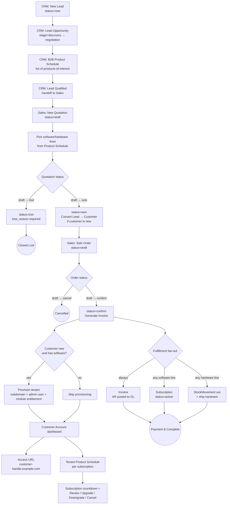

# Hybrid Sales Business Flow

End-to-end lifecycle from raw prospect (CRM) through Quotation/Order/Invoice (Sales) to a provisioned customer tenant. Covers both SaaS subscriptions and physical hardware.

> Status legend: **Shipped** = implementation matches today. **Planned** = target state described in this document; code refactor pending. The new Quotation `draft/won/lost` statuses, the `B2B Product Schedule` CRM entity, and the move of tenant provisioning from `SubscriptionConfirmed` → `OrderConfirmed` are **Planned**.

## Canonical lifecycle

## Status rules (target)

### Quotation

| Status | Editable | Transitions out | Side effects |
|---|---|---|---|
| `draft` | Yes | → `won`, → `lost` | Editable line items, prices, discounts. |
| `won` | No | (terminal) | If the linked Lead has no Customer, **convert Lead → Customer** in the same transaction. Auto-create a `draft` Sale Order from the snapshot. |
| `lost` | No | (terminal) | Requires non-empty `loss_reason`. Closes the Lead as `unqualified` or attaches the reason for funnel analytics. |

### Sale Order

| Status | Editable | Transitions out | Side effects |
|---|---|---|---|
| `draft` | Yes | → `confirm`, → `cancel` | Editable header/lines while still draft. |
| `confirm` | No (can cancel) | → `cancel` | **Generates Invoice** (1:1), Subscription (if any software line), StockMovement out (per hardware line). **Provisions tenant** if customer is new and order contains software. All inside one transaction. |
| `cancel` | No | (terminal) | Reversal of an already-confirmed order requires credit-note / restock — see FMS / Inventory. |

### Subscription

| Status | Editable | Allowed actions | Side effects |
|---|---|---|---|
| `active` | Limited | Renew, Upgrade, Downgrade, Cancel | Countdown to `end_date` shown in customer account. Renew extends `end_date`. Upgrade/Downgrade swaps product or plan-tier variant; bills a delta. |
| `expired` | No | (terminal until renewed) | Tenant kept; module visibility reduces to a configurable read-only set or fully suspended per policy. |
| `cancelled` | No | (terminal) | Tenant kept (data retention policy decides deprovisioning); audit log records actor + reason. |

## Status migration plan (planned)

Map-in-place migration when the code refactor lands. Single transactional migration per tenant DB:

| Table | Legacy → Target |
|---|---|
| `quotations.status` | `new` → `draft` · `confirmed` → `won` · `cancelled` → `lost` (loss_reason backfilled to "legacy cancellation" where null) |
| `orders.status` | `new` → `draft` · `confirmed` → `confirm` · `cancelled` → `cancel` |
| `subscriptions.status` | `new` → `active` · `confirmed` → `active` · `cancelled` → `cancelled` (unchanged) · `active`/`expired` → unchanged |

Legacy constants (`Quotation::STATUS_NEW`, etc.) are removed in the same release. Run `php artisan tenants:migrate` to apply per-tenant.

## Cross-module handoffs

- **CRM → Sales** on Lead Qualified: the qualified Lead's `OpportunityProductSchedule` lines are presented as defaults in the new Quotation builder. No automatic Quotation creation any more — the rep clicks "Create Quotation from Lead".
- **Sales → IAM/Tenant Provisioning** on Order Confirm: `OrderService::confirmOrder` invokes `TenantProvisioningService::provisionForCustomer` when the customer is new and any line is software. The legacy `SubscriptionConfirmed` → `ProvisionSubscriptionTenant` trigger is removed.
- **Sales → FMS** on Order Confirm: the generated Invoice is posted to AR by `InvoiceService::confirm`. Account codes come from `SettingService` (`fms.ar_account_code` etc.).
- **Sales → Inventory** on Order Confirm: hardware lines emit `StockMovement(type=out)` against the resolved default warehouse.
