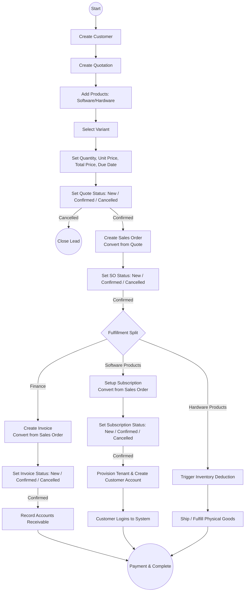

# Hybrid Sales Business Flow

This document illustrates the step-by-step Sales process based on the requested business flow, handling both SaaS system modules and physical hardware.

```mermaid
graph TD
    %% Initial Customer & Quote Phase
    Start((Start)) --> A[Create Customer]
    A --> B[Create Quotation]
    
    %% Quote Details
    B --> B1[Add Products: Software/Hardware]
    B1 --> B2[Select Variant]
    B2 --> B3[Set Quantity, Unit Price, Total Price, Due Date]
    B3 --> C[Set Quote Status: New / Confirmed / Cancelled]
    
    %% Cancellation path
    C -- Cancelled --> End1((Close Lead))
    
    %% Order Conversion Phase
    C -- Confirmed --> D[Create Sales Order <br/> Convert from Quote]
    D --> D1[Set SO Status: New / Confirmed / Cancelled]
    
    %% Parallel Processing from Sales Order
    D1 -- Confirmed --> Split{Fulfillment Split}
    
    %% Path 1: Invoicing (Applies to all)
    Split -->|Finance| E[Create Invoice <br/> Convert from Sales Order]
    E --> E1[Set Invoice Status: New / Confirmed / Cancelled]
    E1 -- Confirmed --> E2[Record Accounts Receivable]
    
    %% Path 2: Software / Subscription Setup
    Split -->|Software Products| F[Setup Subscription <br/> Convert from Sales Order]
    F --> F1[Set Subscription Status: New / Confirmed / Cancelled]
    F1 -- Confirmed --> F2[Provision Tenant & Create Customer Account]
    F2 --> F3[Customer Logins to System]
    
    %% Path 3: Hardware Fulfillment
    Split -->|Hardware Products| G[Trigger Inventory Deduction]
    G --> G1[Ship / Fulfill Physical Goods]

    %% End states
    E2 --> Final((Payment & Complete))
    F3 --> Final
    G1 --> Final
```
