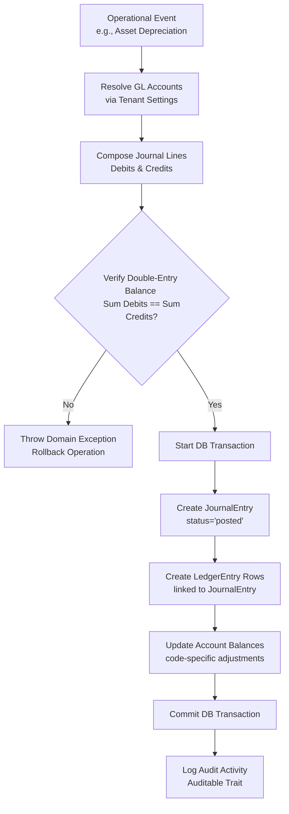
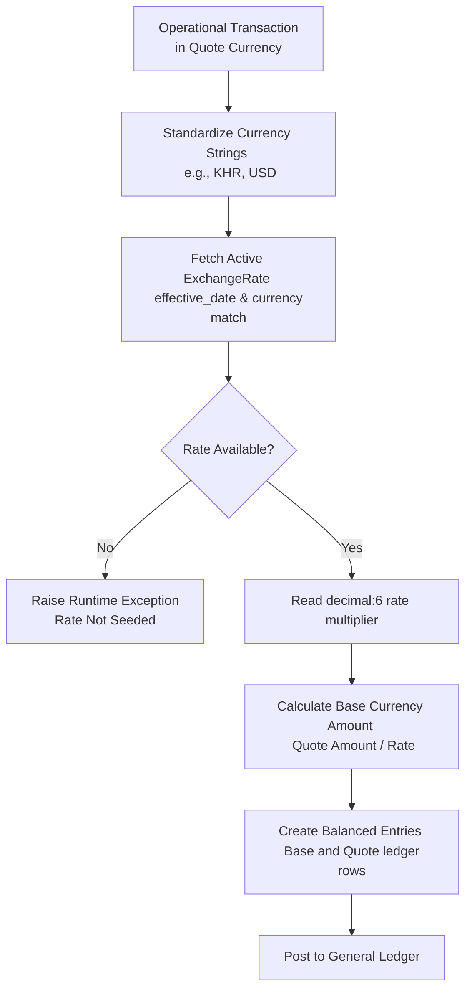
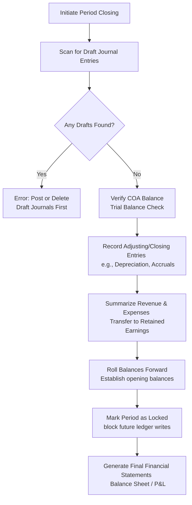

# Accounting & General Ledger Workflows

This document visualizes the core pipelines of the accounting module, showing how transactional data flows across models, checks, and states.

---

## 1. Double-Entry Posting Pipeline

This flow details how operational movements (such as Sales Invoices, Fixed Asset Depreciation, or payroll logs) trigger and complete general ledger entry writing.

---

## 2. Multi-Currency Conversion Flow

This flow maps how transactions executed in a secondary/quote currency are translated and recorded in the tenant's primary functional ledger currency.

---

## 3. Period Closing Workflow

This flow represents the end-of-period closing sequence that freezes historical accounts, rolls balances forward, and prepares the tenant's ledger for a new fiscal period.

