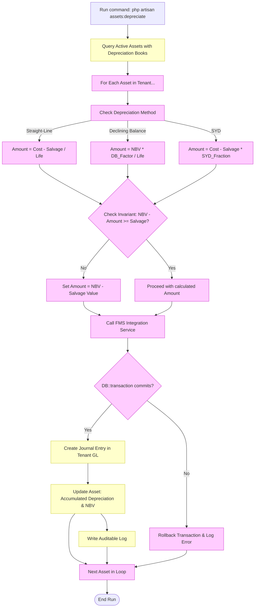

# Fixed Asset Lifecycle & Financial Flows

Below are the key structural and accounting workflows for the Fixed Assets Management module.

---

## 1. End-to-End Asset Lifecycle Flow

This flow illustrates the progression of an asset from procurement capitalization checks down to physical auditing and retirement.

```mermaid
graph TD
    %% Styling
    classDef process fill:#eef,stroke:#33f,stroke-width:1px;
    classDef decision fill:#fee,stroke:#f33,stroke-width:1px;
    classDef integration fill:#efe,stroke:#3f3,stroke-width:1px;

    A[Procurement Bill Approved] --> B{Exceeds Capitalization Threshold?}:::decision
    B -- No --> C[Expense Item directly in FMS]:::process
    B -- Yes --> D[Create Draft Asset Record]:::process
    
    D --> E[Assign Asset Code & Custodian employee_id]:::process
    E --> F[Generate Physical QR Tagging Code]:::process
    F --> G[Deploy Asset to Location]:::process
    
    G --> H{Monthly Scheduled Depreciation Run?}:::decision
    H -- Yes --> I[DepreciationEngineService]:::process
    I --> J[Calculate NBV & Depreciation Amount]:::process
    J --> K{Does NBV stay >= Salvage Value?}:::decision
    K -- No --> L[Cap Depreciation at PurchasePrice - SalvageValue]:::process
    K -- Yes --> M[Generate GL Journal Entries in FMS]:::integration
    
    L --> M
    M --> N[Record audit_logs entry]:::process
    
    N --> O[Periodic Mobile QR Scan Audit]:::process
    O --> P{Status / Location changed?}:::decision
    P -- Yes --> Q[Log Transfer & Asset Condition update]:::process
    P -- No --> R{End of Asset Service Life?}:::decision
    
    Q --> R
    R -- No --> H
    R -- Yes --> S[Asset Disposal Workflow]:::process
    
    S --> T[Calculate final NBV & Scrap/Sale Gain-Loss]:::process
    T --> U[Post Balance-Closing Journal Entry in FMS]:::integration
    U --> V[Retire Asset / SoftDelete Asset Record]:::process
    V --> W([End: Decommissioned])
    
    class D,E,F,G,I,J,N,O,Q,S,T,V process;
    class B,H,K,P,R decision;
    class C,M,U integration;
```

---

## 2. Monthly Depreciation Sub-Flow

Detailed breakdown of how the automated background depreciation runner processes calculations and connects to FMS:

