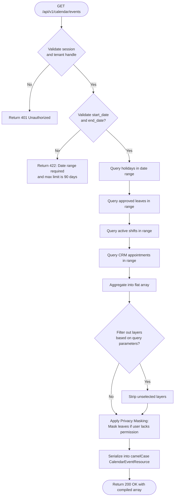
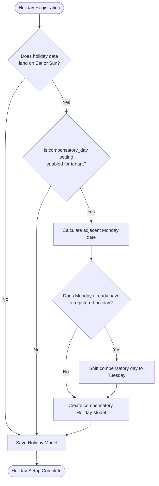
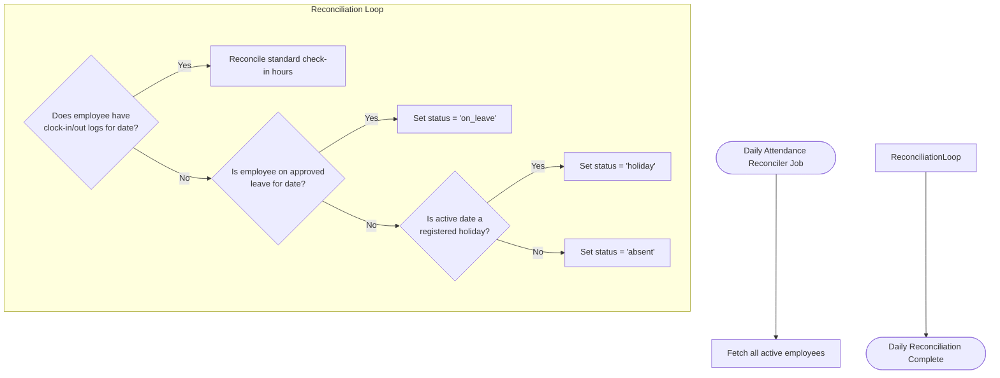

# Unified Calendar and Holiday Workflows

This document maps the operational cashier lifecycles, real-time sync systems, and financial posting pipelines of the Unified Calendar and Holiday Management module using visual Mermaid diagrams.

---

## 1. Unified Event Compilation Flow

This flowchart describes how the `CalendarEventService` aggregates and compiles scheduling data across different databases and modules into a unified, filtered feed for the frontend.

---

## 2. Compensatory Day Resolution Flow

This flowchart traces the logic executed when a registered holiday lands on a weekend date, showing how a compensatory day is dynamically provisioned.

---

## 3. Daily Attendance Reconciler Holiday Override Flow

This diagram maps the background daily reconciliation logic, verifying how absences are overridden on registered holiday dates.

