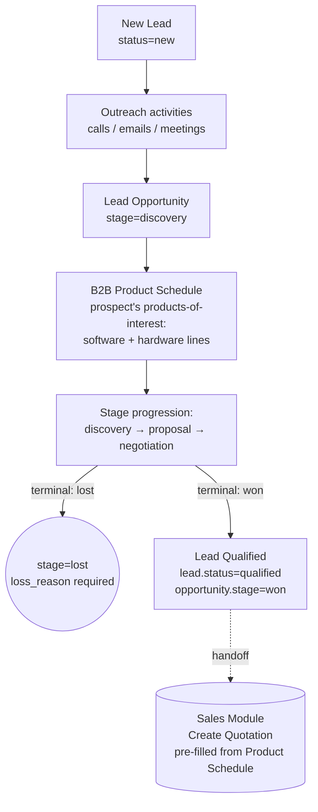
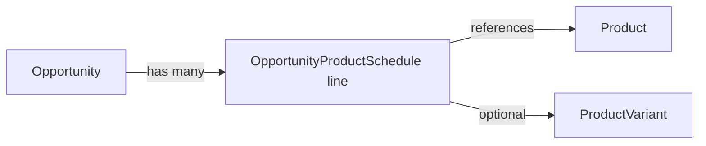
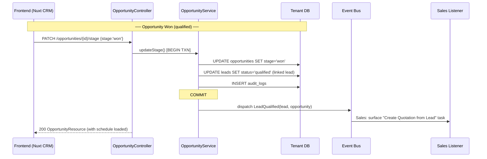
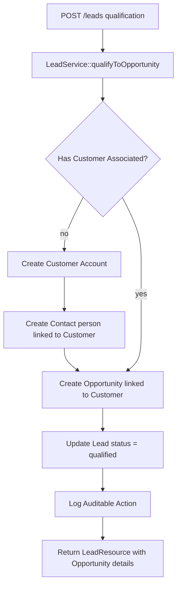
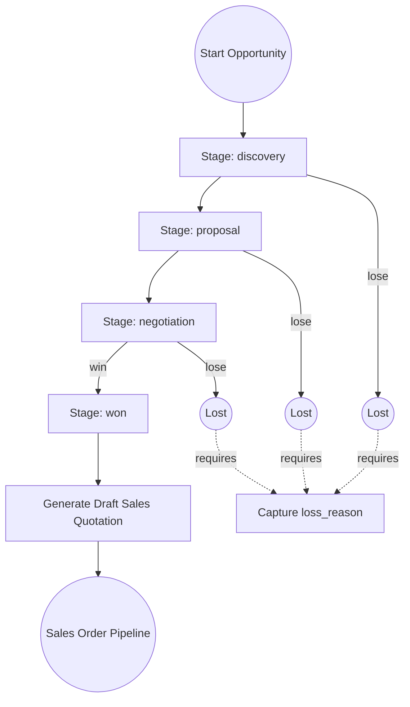

# CRM Workflow Flows

> Status legend: **Shipped** matches current code. **Planned** describes the target state once the refactor in [`rules/hybrid_sales_business_flow.md`](../../rules/hybrid_sales_business_flow.md) lands.
>
> Key planned changes documented here: (1) `OpportunityProductSchedule` (B2B Product Schedule) — new entity attached to an Opportunity; (2) Customer creation is **deferred** out of `LeadService::qualifyToOpportunity` and moved to the Sales-side Quotation `won` transition.

## Full prospect-to-handoff pipeline (Planned)



## Lead lifecycle (Planned)

```mermaid
graph TD
    A[POST /leads — capture raw lead] --> B[status=new]
    B --> B1[Log activities: call/email/meeting]
    B1 --> C[POST /opportunities — promote to Opportunity]
    C --> D[Build B2B Product Schedule<br/>POST /opportunities/{id}/product-schedule]
    D --> E[PATCH /opportunities/{id}/stage<br/>discovery → proposal → negotiation]
    E -- won --> F[Lead Qualified<br/>handoff event LeadQualified dispatched]
    E -- lost --> G[Capture loss_reason<br/>close lead as unqualified]
    F -. handoff .-> H[(Sales: Create Quotation)]
```

Notes:
- `LeadService::qualifyToOpportunity` (Shipped) currently creates a Customer + CrmContact + Opportunity in one transaction. Planned change: **drop the Customer creation** from this step. Customer creation moves to Quotation `won` (Sales).
- `LeadQualified` event is the cross-module handoff signal. Sales listens for it to surface "Create Quotation from Lead" in the rep's task list.

## B2B Product Schedule (Planned)



Schema sketch (`opportunity_product_schedules` table):

| Column | Type | Notes |
|---|---|---|
| `id` | UUID | PK |
| `opportunity_id` | UUID | FK → opportunities.id, indexed |
| `product_id` | UUID | FK → products.id |
| `variant_id` | UUID nullable | FK → product_variants.id |
| `quantity` | decimal(12,2) | Estimated headcount / units |
| `estimated_unit_price` | decimal(15,2) | Pre-negotiation price |
| `cadence` | string | `one_time` \| `monthly` \| `annual` |
| `notes` | text nullable | Why this product is on the schedule |
| `tenant_id` | string | BelongsToTenant scope |
| timestamps + soft deletes | | |

API surface (planned):

| Method | Path | Action |
|---|---|---|
| GET | `/opportunities/{opportunity}/product-schedule` | List the schedule |
| POST | `/opportunities/{opportunity}/product-schedule` | Append a line |
| PATCH | `/opportunities/{opportunity}/product-schedule/{line}` | Update qty / variant / price / cadence |
| DELETE | `/opportunities/{opportunity}/product-schedule/{line}` | Remove a line |

On `Opportunity → won`, the schedule lines are snapshotted as default Quotation items on the Sales side.

## Backend call graph — qualification handoff (Planned)



The planned `LeadQualified` event **replaces** today's `OpportunityWon → CreateDraftQuotationOnOpportunityWon` auto-creation. Reps explicitly create the Quotation so they can edit the product schedule snapshot before sending.

## Lead lifecycle — current (Shipped)



This shipped flow creates the Customer at qualification. The planned flow defers it to Quotation `won`.

## Opportunity pipeline — current (Shipped)



Planned change: drop the auto Quotation generation (the box labeled `Generate Draft Sales Quotation`). Replace with `LeadQualified` event consumed in Sales as a UI prompt.
