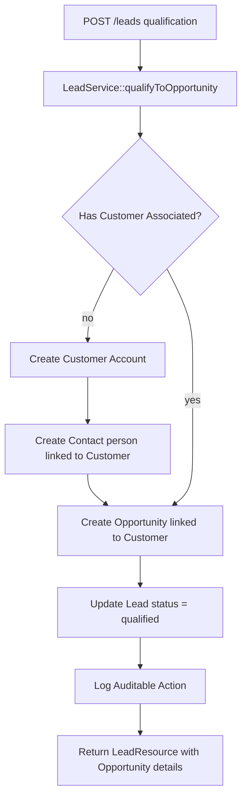
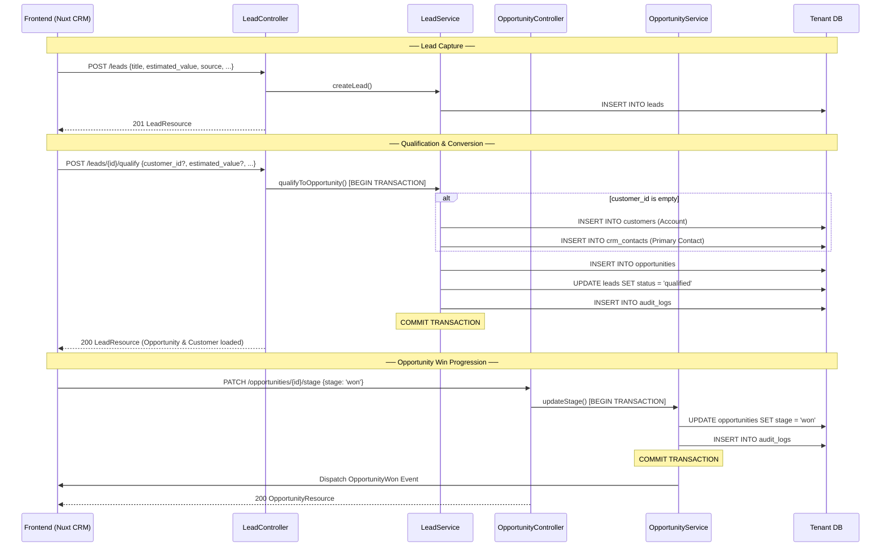

# CRM Workflow Flows

## Lead Qualification & Conversion Flow

```mermaid
graph TD
    A[POST /leads qualification] --> B[LeadService::qualifyToOpportunity]
    B --> C{Has Customer Associated?}
    C -- no --> D[Create Customer Account]
    D --> E[Create Contact person linked to Customer]
    E --> F[Create Opportunity linked to Customer]
    C -- yes --> F
    F --> G[Update Lead status = qualified]
    G --> H[Log Auditable Action]
    H --> I[Return LeadResource with Opportunity details]
```

---

## Canonical Opportunity Pipeline

```mermaid
graph TD
    Start((Start Opportunity)) --> Disc[Stage: Discovery]
    Disc --> Prop[Stage: Proposal]
    Prop --> Nego[Stage: Negotiation]
    
    Disc -- lose --> L1((Lost))
    Prop -- lose --> L2((Lost))
    Nego -- lose --> L3((Lost))
    
    Nego -- win --> W1[Stage: Won]
    W1 --> Q[Generate Draft Sales Quotation]
    Q --> Finish((Sales Order Pipeline))
    
    L1 -. requires .-> R[Capture loss_reason]
    L2 -. requires .-> R
    L3 -. requires .-> R
```

---

## Backend Call Graph (Lead & Opportunity Lifecycle)

```mermaid
sequenceDiagram
    participant FE as Frontend (Nuxt CRM)
    participant LC as LeadController
    participant LS as LeadService
    participant OC as OpportunityController
    participant OS as OpportunityService
    participant DB as Tenant DB
    
    Note over FE,DB: ── Lead Capture ──
    FE->>LC: POST /leads {title, estimated_value, source, ...}
    LC->>LS: createLead()
    LS->>DB: INSERT INTO leads
    LC-->>FE: 201 LeadResource
    
    Note over FE,DB: ── Qualification & Conversion ──
    FE->>LC: POST /leads/{id}/qualify {customer_id?, estimated_value?, ...}
    LC->>LS: qualifyToOpportunity() [BEGIN TRANSACTION]
    alt customer_id is empty
        LS->>DB: INSERT INTO customers (Account)
        LS->>DB: INSERT INTO crm_contacts (Primary Contact)
    end
    LS->>DB: INSERT INTO opportunities
    LS->>DB: UPDATE leads SET status = 'qualified'
    LS->>DB: INSERT INTO audit_logs
    Note over LS: COMMIT TRANSACTION
    LC-->>FE: 200 LeadResource (Opportunity & Customer loaded)

    Note over FE,DB: ── Opportunity Win Progression ──
    FE->>OC: PATCH /opportunities/{id}/stage {stage: 'won'}
    OC->>OS: updateStage() [BEGIN TRANSACTION]
    OS->>DB: UPDATE opportunities SET stage = 'won'
    OS->>DB: INSERT INTO audit_logs
    Note over OS: COMMIT TRANSACTION
    OS->>FE: Dispatch OpportunityWon Event
    OC-->>FE: 200 OpportunityResource
```
