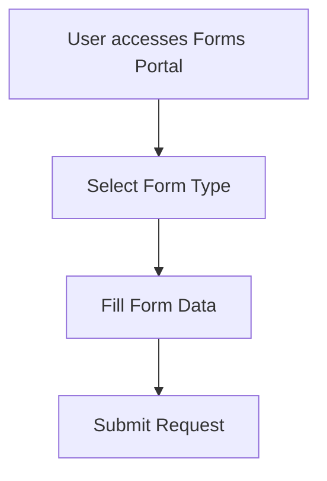
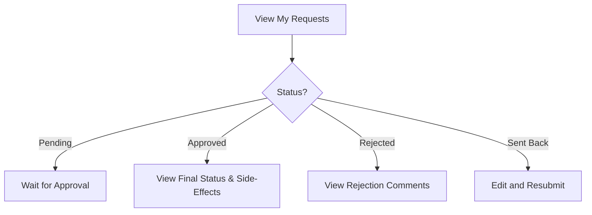
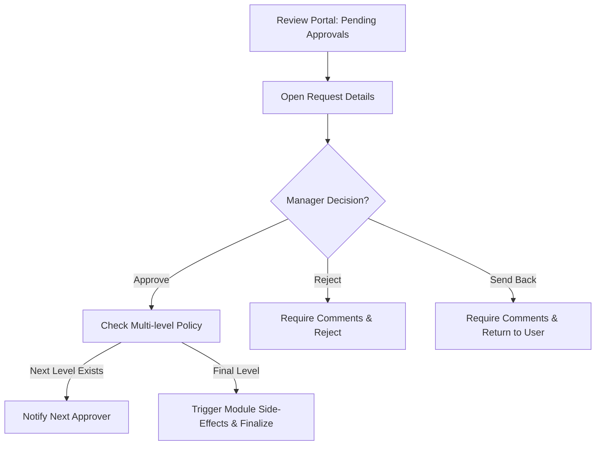
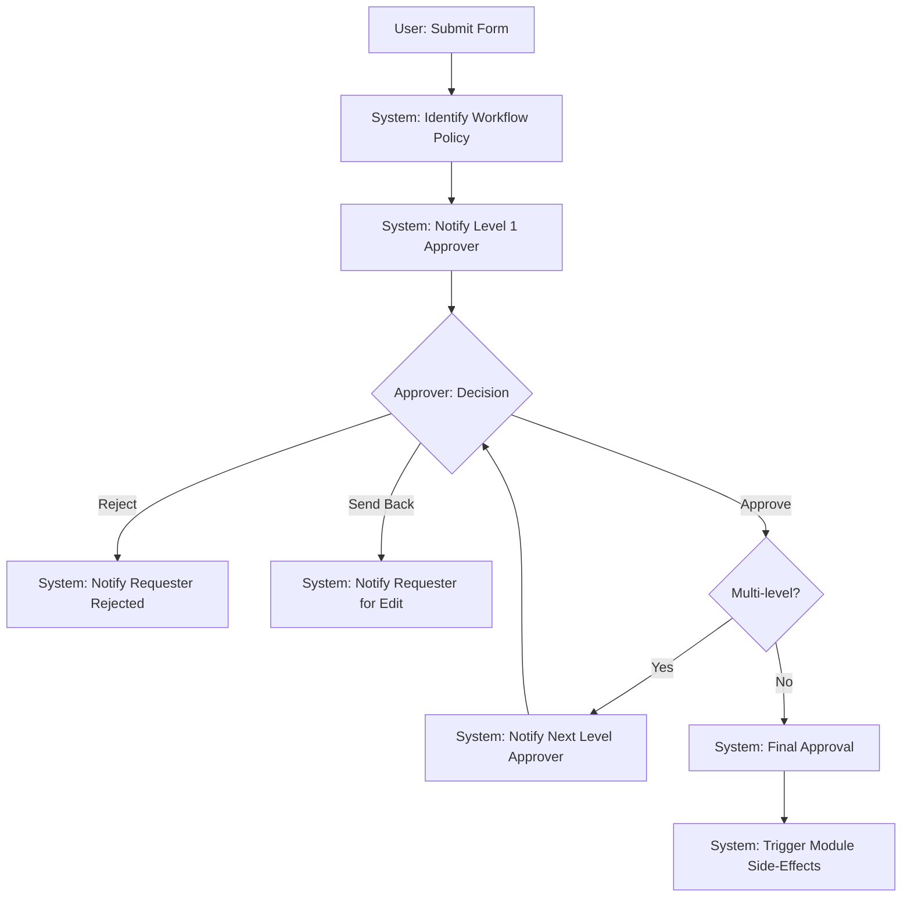

# eApprovals Workflow Flow

## 1. Forms
*(Show all forms for users)*
This section allows users to view and select dynamic forms based on the module (e.g., Leave Request, Overtime Request, Expense, Petty Cash, Personal). The forms are dynamic and adapt to the requested type.

## 2. Requests
*(For User)*
This section allows users to track the status of their submitted requests, view history, and handle any returned/sent back requests.

## 3. Approvals
*(For Manager: has permission to approve, reject)*
This section is for managers (or designated approvers) to review pending requests, view details, and make decisions.

## Overall System Integration Flow

