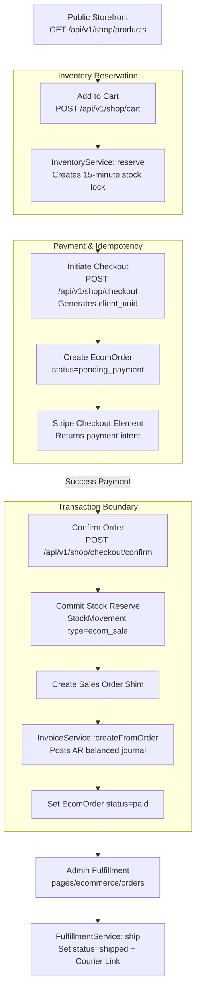
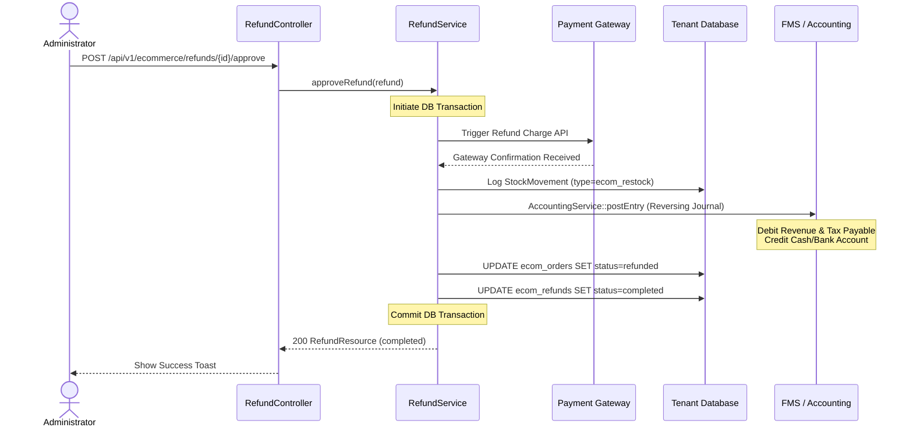
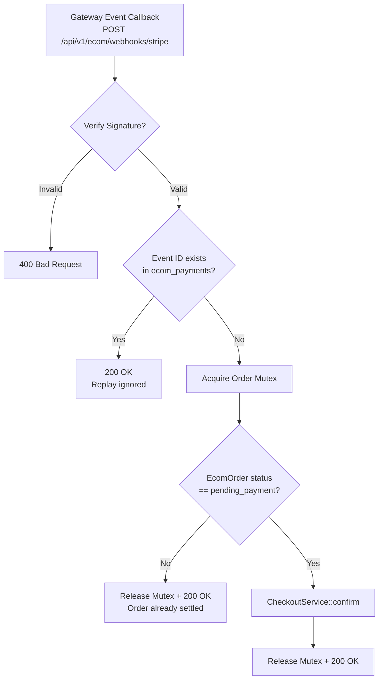
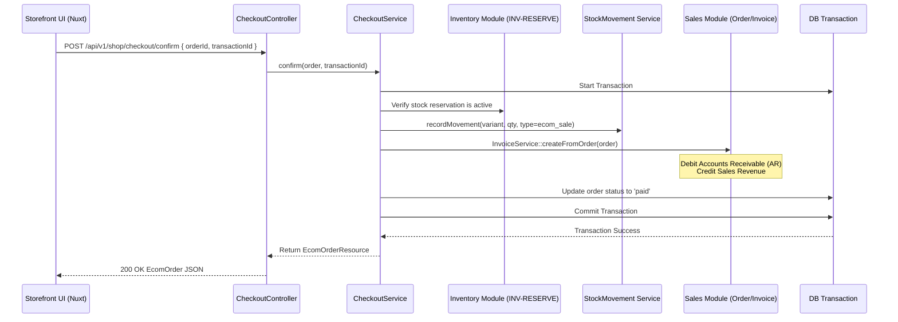

# eCommerce Module Architectural Flows

## 1. Full B2C Customer Journey

This diagram depicts the end-to-end checkout flow from browsing to inventory reservation, payment authorization, downstream sales order generation, and fulfillment:

---

## 2. Refund Lifecycle Sequence (FMS & Inventory)

This diagram details the sequence triggered during an admin refund approval, demonstrating cash/bank reversals and inventory restocking:

---

## 3. Webhook Idempotency Check

This flow shows how the webhook gateway secures and processes callbacks safely without double-capturing or processing replays:

---

## 4. API Surface Routing Matrix

All endpoints must be declared in `routes/tenant.php` scoped under module comments:

| Method | Path | Action / Controller | Authentication | Role Guard |
|:---|:---|:---|:---|:---|
| **GET** | `/api/v1/shop/products` | `StorefrontController@index` | Public (Cached 60s) | - |
| **GET** | `/api/v1/shop/products/{slug}`| `StorefrontController@show` | Public | - |
| **POST**| `/api/v1/shop/cart` | `CartController@addItem` | Guest session OR Shopper | - |
| **POST**| `/api/v1/shop/cart/merge` | `CartController@mergeCart` | Shopper Authenticated | `shopper` |
| **POST**| `/api/v1/shop/checkout` | `CheckoutController@initiate`| Shopper Authenticated | `shopper` |
| **POST**| `/api/v1/shop/checkout/confirm`| `CheckoutController@confirm`| Shopper Authenticated | `shopper` |
| **POST**| `/api/v1/ecom/webhooks/{provider}`| `WebhookController@handle`| Signature Verified Only | - |
| **GET** | `/api/v1/ecommerce/orders` | `OrderController@index` | Central Admin Auth | `ecommerce.orders.read` |
| **PATCH**| `/api/v1/ecommerce/orders/{id}/fulfill`| `FulfillmentController@ship`| Central Admin Auth | `ecommerce.orders.write` |
| **POST**| `/api/v1/ecommerce/refunds` | `RefundController@request` | Central Admin Auth | `ecommerce.refunds.write` |
| **POST**| `/api/v1/ecommerce/refunds/{id}/approve`| `RefundController@approve`| Central Admin Auth | `ecommerce.refunds.approve` |

---

## 5. Backend Call Graph: Storefront checkout

