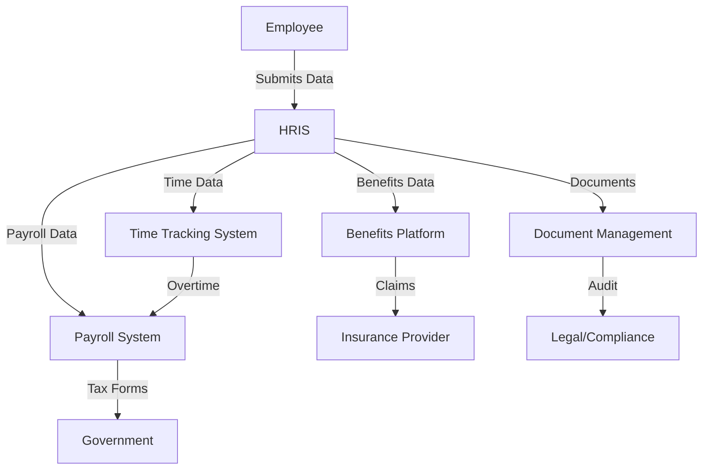

# **HR Staff Information Collection – Requirements Context & Feature Specification**
**Version**: 1.0
**Last Updated**: May 22, 2026
**Owner**: HR Department
**Stakeholders**: HR, Legal, IT, Payroll, Compliance

---

## **📌 1. Purpose**
This document defines the **requirements, scope, and constraints** for collecting, storing, and managing **employee data** by HR. It ensures compliance with **labor laws, data privacy regulations (e.g., GDPR, PDPA, Cambodia’s Labor Law)**, and organizational policies.

---

## **🎯 2. Scope**
### **In Scope**
- All **employee data** collected from **pre-hire to post-termination**.
- **Mandatory and optional** fields for HR records.
- **Data retention, access control, and security** requirements.
- **Compliance** with local and international regulations.

### **Out of Scope**
- **Third-party vendor data** (e.g., outsourced payroll providers).
- **Non-employee data** (e.g., contractors, interns unless specified).
- **Real-time monitoring** (e.g., keystroke logging, live surveillance).

---

---

## **📋 3. Functional Requirements**

> **Recruitment Integration Note**: The collection of this data begins during the **Recruitment phase**. Core fields such as Full Name, Email, Phone, Resumes, and Certifications are initially captured on the Candidate/Application record. The transfer to a new Employee Profile is **not** triggered by offer acceptance — it runs inside `SyncEmployeeAppointmentFromApproval` when HR's Employee Appointment request is approved through eApprovals. At that point `RecruitmentService::convertToEmployee` materialises the Employee row using the appointment's editable overrides (which default to the captured candidate data) and the application status advances from `hired` to `onboarding`. This keeps the HR governance gate in front of payroll provisioning while still eliminating duplicate data entry. See `skills/hrm/recruitment/flow.md` § Stage 5 §6 for the full automation chain.

### **3.1 Core Employee Data**
 | **Category**          | **Field**                          | **Type**       | **Mandatory?** | **Sensitive?** | **Retention Period** | **Notes**                          |
 |-----------------------|------------------------------------|----------------|----------------|----------------|----------------------|------------------------------------|
 | **Identification**    | Full Legal Name                    | Text           | ✅ Yes          | ❌ No          | Employment + 7 years | Legal requirement for contracts.   |
 |                       | Date of Birth                      | Date           | ✅ Yes          | ✅ Yes         | Employment + 7 years | Used for benefits/age verification.|
 |                       | Gender                             | Dropdown       | ❌ No           | ❌ No          | Employment + 7 years | Optional for DEI reporting.        |
 |                       | Nationality/Citizenship           | Text           | ✅ Yes          | ❌ No          | Employment + 7 years | Work permit eligibility.           |
 |                       | Employee ID                        | Unique ID      | ✅ Yes          | ❌ No          | Permanent            | Internal tracking.                 |
 |                       | Job Title                          | Text           | ✅ Yes          | ❌ No          | Employment + 2 years | Role classification.               |
 |                       | Department/Team                    | Text           | ✅ Yes          | ❌ No          | Employment + 2 years | Organizational structure.          |
 |                       | Employment Type                    | Dropdown       | ✅ Yes          | ❌ No          | Employment + 2 years | FT/PT/Contract/Temporary.          |
 |                       | Hire Date                          | Date           | ✅ Yes          | ❌ No          | Permanent            | Tenure tracking.                   |
 |                       | Employment Status                  | Dropdown       | ✅ Yes          | ❌ No          | Employment + 2 years | Active/On Leave/Terminated.         |

---

### **3.2 Contact Information**
 | **Category**          | **Field**                          | **Type**       | **Mandatory?** | **Sensitive?** | **Retention Period** | **Notes**                          |
 |-----------------------|------------------------------------|----------------|----------------|----------------|----------------------|------------------------------------|
 | **Contact**           | Home Address                       | Text           | ✅ Yes          | ✅ Yes         | Employment + 2 years | For tax/legal mail.                |
 |                       | Email (Work)                       | Email          | ✅ Yes          | ❌ No          | Employment + 2 years | Company communication.             |
 |                       | Email (Personal)                   | Email          | ❌ No           | ❌ No          | Employment + 2 years | Optional for emergency contact.    |
 |                       | Phone (Mobile)                     | Phone          | ✅ Yes          | ❌ No          | Employment + 2 years | Primary contact.                   |
 |                       | Phone (Home)                       | Phone          | ❌ No           | ❌ No          | Employment + 2 years | Optional.                          |
 | **Emergency Contact** | Emergency Contact Name             | Text           | ✅ Yes          | ✅ Yes         | Employment + 2 years | For safety incidents.              |
 |                       | Emergency Contact Relationship     | Text           | ✅ Yes          | ❌ No          | Employment + 2 years | E.g., Spouse, Parent.               |
 |                       | Emergency Contact Phone            | Phone          | ✅ Yes          | ✅ Yes         | Employment + 2 years | Critical for emergencies.           |

---

### **3.3 Identification & Legal Documents**
 | **Category**          | **Field**                          | **Type**       | **Mandatory?** | **Sensitive?** | **Retention Period** | **Notes**                          |
 |-----------------------|------------------------------------|----------------|----------------|----------------|----------------------|------------------------------------|
 | **Government IDs**    | Passport Number                    | Text           | ✅ Yes          | ✅ Yes         | Employment + 2 years | For expats/foreign hires.          |
 |                       | Passport Copy                      | File (PDF)     | ✅ Yes          | ✅ Yes         | Employment + 2 years | Encrypted storage required.        |
 |                       | National ID Number                 | Text           | ✅ Yes          | ✅ Yes         | Employment + 2 years | Local compliance (e.g., NSSF).     |
 |                       | Driver’s License                   | Text           | ❌ No           | ✅ Yes         | Employment + 2 years | Optional (if job-related).         |
 |                       | Social Security Number (SSN)      | Text           | ✅ Yes          | ✅ Yes         | Employment + 7 years | **Highly restricted access.**      |
 | **Work Authorization**| Work Permit/Visa Number            | Text           | ✅ Yes (if applicable) | ✅ Yes | Employment + 2 years | For foreign employees.             |
 |                       | Residence Permit                   | File (PDF)     | ✅ Yes (if applicable) | ✅ Yes | Employment + 2 years | Encrypted storage.                 |
 |                       | Tax Identification Number (TIN)   | Text           | ✅ Yes          | ✅ Yes         | Employment + 7 years | For tax reporting.                 |

---

### **3.4 Recruitment & Onboarding**
 | **Category**          | **Field**                          | **Type**       | **Mandatory?** | **Sensitive?** | **Retention Period** | **Notes**                          |
 |-----------------------|------------------------------------|----------------|----------------|----------------|----------------------|------------------------------------|
 | **Application**       | Resume/CV                          | File (PDF)     | ✅ Yes          | ❌ No          | 2 years post-hire    | Retain for audit/compliance.        |
 |                       | Cover Letter                       | File (PDF)     | ❌ No           | ❌ No          | 1 year post-hire     | Optional.                          |
 |                       | Application Form                   | File (PDF)     | ✅ Yes          | ❌ No          | 2 years post-hire    | Signed by candidate.               |
 | **References**        | Reference Name                     | Text           | ❌ No           | ❌ No          | 1 year post-hire     | Optional.                          |
 |                       | Reference Contact                  | Text           | ❌ No           | ❌ No          | 1 year post-hire     | Optional.                          |
 | **Background Checks** | Criminal Background Check          | File (PDF)     | ✅ Yes          | ✅ Yes         | 2 years post-hire    | **Restricted to HR/Legal.**         |
 |                       | Credit History (if applicable)    | File (PDF)     | ❌ No           | ✅ Yes         | 1 year post-hire     | For finance roles only.            |
 | **Education**         | Educational Certificates           | File (PDF)     | ✅ Yes          | ❌ No          | Employment + 2 years | Verify qualifications.             |
 |                       | Professional Certifications        | File (PDF)     | ✅ Yes (if applicable) | ❌ No | Employment + 2 years | E.g., PMP, CPA.                    |
 | **Contracts**         | Employment Contract                | File (PDF)     | ✅ Yes          | ✅ Yes         | Employment + 7 years | Signed by employee.                |
 |                       | Offer Letter                       | File (PDF)     | ✅ Yes          | ✅ Yes         | Employment + 2 years | Initial terms.                     |
 |                       | Signed Company Policies            | File (PDF)     | ✅ Yes          | ❌ No          | Employment + 2 years | E.g., Code of Conduct, IT Policy.  |

---

### **3.5 Compensation & Payroll**
 | **Category**          | **Field**                          | **Type**       | **Mandatory?** | **Sensitive?** | **Retention Period** | **Notes**                          |
 |-----------------------|------------------------------------|----------------|----------------|----------------|----------------------|------------------------------------|
 | **Salary**            | Base Salary/Wage                   | Number         | ✅ Yes          | ✅ Yes         | Employment + 7 years | **Payroll access only.**           |
 |                       | Salary Currency                    | Dropdown       | ✅ Yes          | ❌ No          | Employment + 7 years | E.g., USD, KHR.                     |
 |                       | Payment Frequency                  | Dropdown       | ✅ Yes          | ❌ No          | Employment + 7 years | Monthly/Bi-weekly.                 |
 | **Bank Details**      | Bank Name                          | Text           | ✅ Yes          | ✅ Yes         | Employment + 2 years | For direct deposit.                |
 |                       | Bank Account Number                | Text           | ✅ Yes          | ✅ Yes         | Employment + 2 years | **Encrypted storage.**             |
 |                       | Bank Routing Number                | Text           | ✅ Yes          | ✅ Yes         | Employment + 2 years | **Encrypted storage.**             |
 | **Tax**               | Tax Withholding Form (e.g., W-4)   | File (PDF)     | ✅ Yes          | ✅ Yes         | Employment + 7 years | Local equivalent (e.g., Cambodia).|
 |                       | Tax Residency Status              | Dropdown       | ✅ Yes          | ✅ Yes         | Employment + 7 years | For tax compliance.                |
 | **Deductions**        | Retirement Contributions           | Number         | ✅ Yes          | ✅ Yes         | Employment + 7 years | E.g., NSSF, 401(k).                 |
 |                       | Insurance Premiums                 | Number         | ✅ Yes          | ✅ Yes         | Employment + 2 years | Health/dental/vision.              |
 | **Overtime**          | Overtime Hours                     | Number         | ✅ Yes          | ❌ No          | Employment + 2 years | Tracked via timesheets.            |
 |                       | Overtime Rate                      | Number         | ✅ Yes          | ✅ Yes         | Employment + 2 years | **Payroll access only.**           |
 | **Bonuses**           | Bonus Structure                    | Text           | ❌ No           | ✅ Yes         | Employment + 2 years | Performance-based.                 |
 |                       | Commission Structure               | Text           | ❌ No           | ✅ Yes         | Employment + 2 years | Sales roles.                       |

---
### **3.6 Benefits Enrollment**
 | **Category**          | **Field**                          | **Type**       | **Mandatory?** | **Sensitive?** | **Retention Period** | **Notes**                          |
 |-----------------------|------------------------------------|----------------|----------------|----------------|----------------------|------------------------------------|
 | **Health Insurance**  | Enrollment Form                    | File (PDF)     | ✅ Yes          | ✅ Yes         | Employment + 2 years | **HIPAA/GDPR compliance.**         |
 |                       | Beneficiary Name                   | Text           | ✅ Yes          | ✅ Yes         | Employment + 2 years | For life insurance.                |
 |                       | Beneficiary Relationship           | Text           | ✅ Yes          | ❌ No          | Employment + 2 years | E.g., Spouse, Child.                |
 | **Retirement**        | 401(k)/Pension Enrollment          | File (PDF)     | ✅ Yes (if applicable) | ✅ Yes | Employment + 7 years | Local equivalent (e.g., NSSF).     |
 |                       | Contribution Amount                | Number         | ✅ Yes          | ✅ Yes         | Employment + 7 years | Employee/employer split.           |
 | **Other Benefits**    | FSA/HSA Enrollment                 | File (PDF)     | ❌ No           | ✅ Yes         | Employment + 2 years | Optional.                          |
 |                       | Wellness Program Participation     | Boolean        | ❌ No           | ❌ No          | Employment + 1 year  | Optional.                          |

---
### **3.7 Work Performance & Records**
 | **Category**          | **Field**                          | **Type**       | **Mandatory?** | **Sensitive?** | **Retention Period** | **Notes**                          |
 |-----------------------|------------------------------------|----------------|----------------|----------------|----------------------|------------------------------------|
 | **Performance**       | Performance Review                 | File (PDF)     | ✅ Yes          | ✅ Yes         | Employment + 3 years | Manager + HR access only.          |
 |                       | Performance Rating                 | Number         | ✅ Yes          | ❌ No          | Employment + 3 years | E.g., 1-5 scale.                    |
 |                       | Goals & Objectives                 | Text           | ✅ Yes          | ❌ No          | Employment + 1 year  | Annual/quarterly.                   |
 | **Promotions**        | Promotion History                  | Text           | ✅ Yes          | ❌ No          | Employment + 7 years | Dates and new titles.               |
 | **Disciplinary**      | Disciplinary Action                | File (PDF)     | ✅ Yes          | ✅ Yes         | Employment + 7 years | **HR/Legal access only.**          |
 |                       | Warning Type                       | Dropdown       | ✅ Yes          | ✅ Yes         | Employment + 7 years | Verbal/Written/Final.               |
 |                       | Incident Report                     | File (PDF)     | ✅ Yes          | ✅ Yes         | Employment + 7 years | **Confidential.**                   |

---
### **3.8 Leave & Attendance**
 | **Category**          | **Field**                          | **Type**       | **Mandatory?** | **Sensitive?** | **Retention Period** | **Notes**                          |
 |-----------------------|------------------------------------|----------------|----------------|----------------|----------------------|------------------------------------|
 | **Time Tracking**     | Clock-In/Out Records                | Timestamp      | ✅ Yes          | ❌ No          | Employment + 2 years | For payroll compliance.            |
 |                       | Timesheets                         | File (PDF)     | ✅ Yes          | ❌ No          | Employment + 2 years | Weekly/monthly.                    |
 | **Leave**             | Annual Leave Balance               | Number         | ✅ Yes          | ❌ No          | Employment + 2 years | Tracked in HRIS.                    |
 |                       | Sick Leave Records                 | File (PDF)     | ✅ Yes          | ✅ Yes         | Employment + 2 years | **Medical notes restricted.**      |
 |                       | Maternity/Paternity Leave           | File (PDF)     | ✅ Yes          | ✅ Yes         | Employment + 2 years | **Confidential.**                   |
 |                       | Bereavement Leave                  | Boolean        | ✅ Yes          | ❌ No          | Employment + 1 year  | Dates only.                        |
 |                       | Unpaid Leave                       | Boolean        | ✅ Yes          | ❌ No          | Employment + 1 year  | Dates and reason.                  |
 | **Remote Work**       | Remote Work Agreement              | File (PDF)     | ✅ Yes (if applicable) | ❌ No | Employment + 2 years | Signed by employee.                |

---
### **3.9 Health & Medical Information**
 | **Category**          | **Field**                          | **Type**       | **Mandatory?** | **Sensitive?** | **Retention Period** | **Notes**                          |
 |-----------------------|------------------------------------|----------------|----------------|----------------|----------------------|------------------------------------|
 | **Medical**           | Medical Certificate (Sick Leave)   | File (PDF)     | ✅ Yes          | ✅ Yes         | Employment + 1 year  | **HIPAA/GDPR compliance.**         |
 |                       | Disability Accommodation Request  | File (PDF)     | ✅ Yes (if applicable) | ✅ Yes | Employment + 2 years | **HR/Legal access only.**          |
 | **Workers’ Comp**     | Injury Report                      | File (PDF)     | ✅ Yes (if applicable) | ✅ Yes | Employment + 7 years | **Confidential.**                   |
 | **Vaccination**       | Vaccination Records                | File (PDF)     | ✅ Yes (if required) | ✅ Yes | Employment + 2 years | **Restricted access.**             |

---
### **3.10 Tax & Financial Information**
 | **Category**          | **Field**                          | **Type**       | **Mandatory?** | **Sensitive?** | **Retention Period** | **Notes**                          |
 |-----------------------|------------------------------------|----------------|----------------|----------------|----------------------|------------------------------------|
 | **Tax Forms**         | W-2/1099 (or local equivalent)     | File (PDF)     | ✅ Yes          | ✅ Yes         | 7 years              | **Payroll access only.**           |
 | **Dependents**        | Dependent Name                     | Text           | ✅ Yes (if applicable) | ✅ Yes | Employment + 2 years | For tax benefits.                  |
 |                       | Dependent DOB                      | Date           | ✅ Yes (if applicable) | ✅ Yes | Employment + 2 years | **Restricted access.**             |
 | **Garnishments**      | Child Support Order                | File (PDF)     | ✅ Yes (if applicable) | ✅ Yes | Employment + 7 years | **Legal access only.**             |

---
### **3.11 Emergency & Safety**
 | **Category**          | **Field**                          | **Type**       | **Mandatory?** | **Sensitive?** | **Retention Period** | **Notes**                          |
 |-----------------------|------------------------------------|----------------|----------------|----------------|----------------------|------------------------------------|
 | **Emergency**         | Allergies/Medical Conditions       | Text           | ❌ No           | ✅ Yes         | Employment + 2 years | **Voluntary; restricted access.**  |
 |                       | Blood Type                         | Dropdown       | ❌ No           | ✅ Yes         | Employment + 2 years | **Voluntary.**                     |

---
### **3.12 Training & Development**
 | **Category**          | **Field**                          | **Type**       | **Mandatory?** | **Sensitive?** | **Retention Period** | **Notes**                          |
 |-----------------------|------------------------------------|----------------|----------------|----------------|----------------------|------------------------------------|
 | **Training**          | Training Completion Certificate    | File (PDF)     | ✅ Yes          | ❌ No          | Employment + 2 years | Mandatory for compliance.          |
 |                       | Skills Assessment                  | File (PDF)     | ✅ Yes          | ❌ No          | Employment + 2 years | For role fit.                      |
 | **Career Dev**        | Career Development Plan            | File (PDF)     | ❌ No           | ❌ No          | Employment + 1 year  | Optional.                          |

---
### **3.13 IT & System Access**
 | **Category**          | **Field**                          | **Type**       | **Mandatory?** | **Sensitive?** | **Retention Period** | **Notes**                          |
 |-----------------------|------------------------------------|----------------|----------------|----------------|----------------------|------------------------------------|
 | **IT Access**         | Company Email                       | Email          | ✅ Yes          | ❌ No          | Employment + 1 year  | Deactivated post-termination.      |
 |                       | System Usernames                   | Text           | ✅ Yes          | ✅ Yes         | Employment + 1 year  | **IT access only.**                |
 |                       | Access Level/Permissions           | Dropdown       | ✅ Yes          | ✅ Yes         | Employment + 1 year  | **Role-based access.**             |
 | **Devices**           | Assigned Laptop/Phone              | Text           | ✅ Yes          | ❌ No          | Employment + 1 year  | Asset tracking.                    |
 |                       | Software Licenses                  | Text           | ✅ Yes          | ❌ No          | Employment + 1 year  | Compliance audits.                 |

---
### **3.14 Biometric & Security Data**
 | **Category**          | **Field**                          | **Type**       | **Mandatory?** | **Sensitive?** | **Retention Period** | **Notes**                          |
 |-----------------------|------------------------------------|----------------|----------------|----------------|----------------------|------------------------------------|
 | **Biometrics**        | Fingerprint Data                   | Binary         | ✅ Yes (if used) | ✅ Yes         | Employment + 1 year  | **Encrypted; time-tracking only.**  |
 |                       | Facial Recognition Data            | Binary         | ✅ Yes (if used) | ✅ Yes         | Employment + 1 year  | **Encrypted; access-controlled.**   |
 | **Security**          | Security Badge ID                   | Text           | ✅ Yes (if applicable) | ❌ No | Employment + 1 year | Physical access.                   |

---
### **3.15 Termination Data**
 | **Category**          | **Field**                          | **Type**       | **Mandatory?** | **Sensitive?** | **Retention Period** | **Notes**                          |
 |-----------------------|------------------------------------|----------------|----------------|----------------|----------------------|------------------------------------|
 | **Termination**       | Resignation Letter                 | File (PDF)     | ✅ Yes          | ✅ Yes         | Employment + 7 years | **HR/Legal access only.**          |
 |                       | Exit Interview Notes               | Text           | ✅ Yes          | ✅ Yes         | Employment + 2 years | **Confidential.**                   |
 |                       | Final Payroll Statement            | File (PDF)     | ✅ Yes          | ✅ Yes         | Employment + 7 years | **Payroll access only.**           |
 |                       | COBRA/Continuation Forms           | File (PDF)     | ✅ Yes (if applicable) | ✅ Yes | Employment + 2 years | Benefits continuation.             |
 |                       | Reason for Termination             | Dropdown       | ✅ Yes          | ✅ Yes         | Employment + 7 years | **Restricted access.**             |

---
---
## **🔒 4. Non-Functional Requirements**

### **4.1 Data Privacy & Security**
 | **Requirement**               | **Description**                                                                                     | **Compliance Standard**          |
 |--------------------------------|-----------------------------------------------------------------------------------------------------|-----------------------------------|
 | **Encryption**                 | All **sensitive data** (SSN, bank details, medical records) must be **encrypted at rest and in transit**. | GDPR, PDPA, ISO 27001             |
 | **Access Control**             | **Role-based access** (e.g., HR Admin, Payroll, Manager) with **least privilege principle**.       | GDPR, SOC 2                      |
 | **Audit Logs**                 | All **access/modifications** to employee data must be **logged and auditable**.                   | GDPR, HIPAA                       |
 | **Data Minimization**          | Only collect **necessary data**; avoid excessive or irrelevant information.                        | GDPR, PDPA                        |
 | **Consent Management**        | Employees must be **informed** of data collection purposes and **consent** where required.        | GDPR, PDPA                        |
 | **Anonymization**              | For analytics, use **pseudonymization** or **aggregation** to protect identities.                | GDPR                              |

### **4.2 Data Retention & Disposal**
 | **Data Type**               | **Retention Period** | **Disposal Method**                          | **Compliance**               |
 |-----------------------------|----------------------|---------------------------------------------|------------------------------|
 | **Payroll Records**          | 7 years              | Secure deletion/shredding                   | Labor Law, Tax Regulations   |
 | **Tax Documents**           | 7 years              | Secure deletion/shredding                   | IRS/Local Tax Authority      |
 | **Medical Records**         | 2 years post-employment | Secure deletion (HIPAA-compliant)       | HIPAA, GDPR                  |
 | **Disciplinary Records**    | 7 years              | Secure deletion (legal hold if litigation)  | Labor Law                    |
 | **Background Checks**       | 2 years              | Secure deletion                              | FCRA (if applicable)         |
 | **Biometric Data**          | 1 year               | **Permanent deletion** (no archiving)        | GDPR, Biometric Privacy Laws |

### **4.3 Compliance Requirements**
 | **Regulation**       | **Applicability**               | **Key Requirements**                                                                 |
 |----------------------|----------------------------------|--------------------------------------------------------------------------------------|
 | **GDPR**             | EU employees or global ops      | Right to access, rectification, erasure; data minimization; consent management.     |
 | **PDPA**             | Cambodia                         | Employee consent; data localization (if applicable); breach notification.            |
 | **HIPAA**            | US (health data)                 | Protection of **PHI (Protected Health Information)**; access controls.             |
 | **FLSA**             | US (wage/hour)                   | Accurate **timekeeping and payroll records** (2+ years retention).                 |
 | **Cambodia Labor Law** | All employees in Cambodia       | **Employment contracts**, payroll records, and **termination documentation** required. |

---
---
## **🛠️ 5. Technical Requirements**

### **5.1 System Integrations**
 | **System**            | **Purpose**                          | **Data Shared**                          | **Security**                          |
 |-----------------------|--------------------------------------|------------------------------------------|---------------------------------------|
 | **HRIS** (e.g., BambooHR, Workday) | Central employee database | All HR data (except highly sensitive)    | **SSO, MFA, Role-Based Access**       |
 | **Payroll System**    | Salary processing                    | Payroll, tax, bank details               | **Encrypted API, Audit Logs**         |
 | **Benefits Platform** | Health/retirement enrollment         | Beneficiary, medical data                | **HIPAA-compliant encryption**        |
 | **Time Tracking**     | Attendance/hrm/overtime                  | Clock-in/out, leave records               | **Access-controlled logs**            |
 | **Document Management** (e.g., SharePoint) | Secure file storage | Resumes, contracts, medical certs | **Encryption, Version Control**       |

### **5.2 Data Storage**
- **Cloud Storage**: AWS S3 (encrypted), Google Drive (with DLP), or **on-premise servers** (for sensitive data).
- **Database**: PostgreSQL/MySQL with **row-level security** for sensitive fields.
- **Backup**: **Daily automated backups** with **30-day retention** (tested quarterly).

### **5.3 API & Data Transfer**
- **API Security**: **OAuth 2.0, JWT tokens, rate limiting**.
- **Data in Transit**: **TLS 1.2+ encryption**.
- **Data at Rest**: **AES-256 encryption** for sensitive fields.

---
---
## **📊 6. Business Rules**

### **6.1 Mandatory Fields**
- **Pre-Hire**: Name, DOB, Contact Info, Job Title, Contract.
- **Onboarding**: Bank Details, Tax Forms, Emergency Contact.
- **Ongoing**: Performance Reviews (annual), Leave Records.

### **6.2 Optional Fields (With Consent)**
- Gender, Personal Email, Blood Type, Wellness Program Participation.

### **6.3 Restricted Fields (HR/Legal Only)**
- SSN, Criminal Background Checks, Disciplinary Actions, Medical Records.

### **6.4 Automated Workflows**
 | **Trigger**               | **Action**                                                                 |
 |---------------------------|----------------------------------------------------------------------------|
 | New Hire                  | Auto-generate **employee ID**, send **onboarding checklist**.           |
 | Termination               | **Revoke system access**, schedule **exit interview**, archive records.   |
 | Leave Request             | **Notify manager**, update **leave balance**, check **compliance**.      |
 | Performance Review Due    | **Email reminder** to manager + employee.                                |

---
---
## **📝 7. Assumptions & Dependencies**

### **7.1 Assumptions**
- Employees **consent** to data collection during onboarding.
- **Local laws** (e.g., Cambodia’s Labor Law) take precedence over this document.
- **Third-party vendors** (e.g., payroll providers) comply with **data protection agreements**.

### **7.2 Dependencies**
 | **Dependency**            | **Impact if Unavailable**                          |
 |---------------------------|---------------------------------------------------|
 | HRIS System               | Manual data entry; increased risk of errors.      |
 | Payroll System            | Delayed salary payments; compliance violations.  |
 | Legal Team                | Risk of non-compliance with data privacy laws.   |
 | IT Security               | Data breaches; loss of sensitive information.     |

---
---
## **⚠️ 8. Risks & Mitigations**
 | **Risk**                          | **Likelihood** | **Impact** | **Mitigation**                                  |
 |-----------------------------------|----------------|------------|-----------------------------------------------|
 | Data Breach (SSN, Bank Details)   | Medium         | High       | **Encryption, MFA, Regular Audits**           |
 | Non-Compliance with GDPR/PDPA     | High           | High       | **Legal review, DPO appointment**              |
 | Employee Data Theft               | Low            | High       | **Access controls, Training, DLP tools**       |
 | Incorrect Payroll Calculations    | Medium         | Medium     | **Automated validation, Double-check workflows** |
 | Loss of Critical Documents        | Low            | Medium     | **Cloud backups, Versioning**                 |

---
---
## **📅 9. Open Questions**
1. Should **biometric data** (fingerprint/facial recognition) be **stored locally only** (no cloud)?
2. What is the **exact retention period** for **medical records** under Cambodia’s Labor Law?
3. Should **former employees** have **right to access** their data post-termination?
4. How should **cross-border data transfers** (e.g., for global payroll) be handled?

---
---
## **🎯 10. Glossary**
 | **Term**               | **Definition**                                                                 |
 |------------------------|-------------------------------------------------------------------------------|
 | **HRIS**               | Human Resource Information System (e.g., BambooHR, Workday).              |
 | **PHI**                | Protected Health Information (HIPAA).                                       |
 | **PII**                | Personally Identifiable Information (e.g., SSN, Passport Number).           |
 | **GDPR**               | General Data Protection Regulation (EU).                                     |
 | **PDPA**               | Personal Data Protection Act (Cambodia).                                    |
 | **DLP**                | Data Loss Prevention (tools to prevent unauthorized data sharing).         |
 | **SSO**                | Single Sign-On (centralized authentication).                                  |
 | **MFA**                | Multi-Factor Authentication (e.g., SMS, Authenticator App).                 |

---
---
## **📄 Appendix A: Sample Data Flow Diagram**

