# **Recruitment Module: Applicant Flow Context**

*Human Resource Management (HRM) System*

---

## **1. Overview**

This document outlines the **end-to-end flow for applicants** in the **Recruitment Module** of the HRM system. It covers the journey from **sourcing to onboarding**, including key stages, stakeholders, automation opportunities, and metrics for success.

**Purpose**:

- Standardize the recruitment process.
- Improve efficiency and candidate experience.
- Provide a reference for HR, hiring managers, and developers.

---

## **2. Applicant Flow Stages**

### **Stage 1: Sourcing**

**Objective**: Attract qualified candidates for open positions.

#### **Sub-Processes**

1. **Job Requisition Creation**
  - **Action**: Hiring manager submits a request via HRM system.
  - **Details**:
    - Job title, description, requirements.
    - Department, reporting line, salary range.
    - Urgency (e.g., "Fill within 30 days").
  - **Approval**: HR reviews and approves the requisition.
2. **Job Posting**
  - **Action**: HR posts the job to:
    - Company careers page (integrated with ATS).
    - External platforms (LinkedIn, Indeed, Glassdoor).
    - Internal referrals (employee referral program).
  - **Automation**: ATS syncs postings across platforms.
3. **Candidate Sourcing**
  - **Active Sourcing**: Recruiters search for passive candidates (e.g., LinkedIn Recruiter).
  - **Passive Sourcing**: Candidates apply directly via job postings.

#### **Output**

- Pool of applicants in the ATS.

---

### **Stage 2: Application**

**Objective**: Collect and organize candidate information.

#### **Sub-Processes**

1. **Application Submission**
  - Candidates apply via:
    - **Careers Portal**: Online form with resume/CV upload.
    - **Email**: Resumes sent to `careers@company.com`.
    - **Walk-ins**: For local hires (e.g., Cambodia-based roles).
  - **Data Captured**:
    - Personal details (name, contact info).
    - Resume/CV, cover letter.
    - Portfolio/links (for creative/technical roles).
2. **Automated Acknowledgment**
  - System sends a **confirmation email** to the applicant:
    - "Thank you for applying. We’ll review your application and contact you if there’s a match."
3. **Data Entry into ATS**
  - If applied via email/walk-in, HR manually uploads the resume to the ATS.
  - **Automation**: ATS parses resumes to extract key fields (skills, experience, education).

#### **Output**

- Candidate profile created in the ATS with a unique **Applicant ID**.
- Server auto-stamps a human-readable **Candidate Code** following the pattern `CAN-<YYYYMM>-<NNN>` (e.g. `CAN-202605-001`). The numeric component resets per-month and is derived from `applied_at`; withdrawn rows keep their numbers (audit invariant — see [`hrm/rules.md`](../rules.md) "Auto-generated `applications.candidate_code`"). Surfaced in the application list table, the kanban card subtitle, and details modals so recruiters can reference a candidate by code instead of UUID.

---

### **Stage 3: Screening**

**Objective**: Shortlist candidates for interviews.

#### **Sub-Processes**

1. **Resume Screening**
  - **Action**: HR/Recruiter reviews applications based on:
    - Job requirements (skills, experience, education).
    - Keywords (e.g., "Python," "Project Management").
  - **Automation**:
    - ATS ranks candidates using **keyword matching** or **AI scoring**.
    - Flags mismatches (e.g., missing required skills).
2. **Initial Phone/Video Screen**
  - Recruiter conducts a **15-30 minute call** to:
    - Verify qualifications.
    - Assess communication skills and cultural fit.
    - Explain the role and company.
  - **Outcome**:
    - **Advance to Interview**: Schedule next round.
    - **Reject**: Send a polite rejection email (template from ATS).
3. **Shortlisting**
  - Recruiter creates a **shortlist** of candidates for the hiring manager.
  - **Collaboration**: Hiring manager reviews and approves the shortlist.

#### **Output**

- Shortlisted candidates move to the **Interview Stage**.

---

### **Stage 4: Interview Process**

**Objective**: Evaluate candidates for fit and competence.

#### **Sub-Processes**

1. **Interview Scheduling**
  - Recruiter coordinates with:
    - Hiring manager.
    - Interview panel (e.g., team leads, peers).
    - Candidate (via email/calendar invite).
  - **Automation**:
    - ATS integrates with **Google Calendar/Outlook** to send invites.
    - Candidates receive **reminders** (24 hours before).
2. **Interview Types**
  - **Technical Round**: For role-specific skills (e.g., coding test for developers).
  - **Behavioral Round**: Soft skills, cultural fit (e.g., STAR method questions).
  - **Panel Interview**: Multiple interviewers (e.g., HR, manager, team member).
  - **Assignment/Case Study**: For roles requiring practical skills (e.g., marketing plan, coding challenge).
3. **Feedback Collection**
  - Interviewers submit feedback via **structured forms** in the ATS:
    - Rating (1-5 scale).
    - Strengths/weaknesses.
    - Recommendation (Hire/Reject/Hold).
  - **Automation**:
    - ATS aggregates feedback and calculates an **average score**.
    - Flags conflicts (e.g., one interviewer says "Hire," another says "Reject").
4. **Decision**
  - Hiring manager reviews feedback and makes a decision:
    - **Advance to Next Round**: Repeat interview process.
    - **Offer**: Move to Stage 5.
    - **Reject**: Send rejection email.

#### **Output**

- Final candidate(s) selected for an offer.

---

### **Stage 4.5: Hire → Employee Conversion**

**Objective**: Promote a hired application into a workforce-registry `Employee` record so the new hire appears in directory listings, payroll, leave, and downstream HRM features.

**Hard rule**: Transitioning the application to `hired` (Stage 4 Decision) **only changes status**. It does NOT create an Employee record. The link is an explicit, audit-bounded step performed by HR — never a side-effect of the kanban drag.

**Primary path (production)**: After offer acceptance (Stage 5) the application sits in `hired`. HR submits an Employee Appointment request through eApprovals; on approval the listener `SyncEmployeeAppointmentFromApproval` calls `convertToEmployee` and the application advances to `onboarding`. See Stage 5 §6 for the full automation chain.

**Direct convert endpoint (admin / exception path)**: The legacy `POST /applications/{application}/convert-to-employee` is retained for tenants who skip the eApprovals gate or for backfilling historical hires that pre-date Phase 8. It is not the recommended path for new hires and the candidate UI hides it behind `hrm.recruitment.write + hrm.employee.write`.

#### **Sub-Processes**

1. **Single Conversion**
  - **Trigger**: Recruiter/HR clicks "Convert to Employee" on a `hired` application — surfaced on:
    - The kanban card (`/candidates`) hired-column conditional slot.
    - The application list (`/applications`) row kebab menu.
    - The application details modal footer.
  - **Endpoint**: `POST /applications/{application}/convert-to-employee` → `RecruitmentService::convertToEmployee`.
  - **Behavior**:
    - Idempotent — repeat calls on the same application return the existing employee.
    - Dedupe-by-email — if an **active** `Employee` with the same email already exists, link to that one rather than cloning (response sets `linkedExisting: true` so the UI can toast accurately). Soft-deleted matches (terminated or post-revert) are ignored — a fresh row is created instead, so rehires get a new Employee record. The DB enforces this via a partial unique index on `email` (`deleted_at IS NULL` only).
    - Copies `department_id`, `position_id` from the vacancy, `expected_salary` → `base_salary`.
    - Stamps `applications.converted_at = now()`; creates the employee in `active` status.
    - **Auto-assigns `employee_id`** in the `<prefix>-<NNNN>` pattern via `RecruitmentService::generateNextEmployeeId()`. Zero-indexed — on a fresh tenant the first auto-issued ID is `TT-0000`, then `TT-0001`, `TT-0002`, … Sequence is global across the tenant. **Terminated employees keep their IDs** (so historical references resolve), but **reverted employees free their IDs** (see the Revert sub-process below) so the next convert can re-issue them. The pad width is a floor — past `TT-9999` the format widens to `TT-10000` automatically. Prefix and pad live as class constants (`EMPLOYEE_ID_PREFIX`, `EMPLOYEE_ID_PAD`).
  - **Permissions**: `hrm.recruitment.write` + `hrm.employee.write` (policy `ApplicationPolicy::convert`).

2. **Bulk Conversion**
  - **Trigger**: User selects multiple `hired`-and-unlinked rows on `/applications` and clicks "Convert N to Employee" in the bulk toolbar.
  - **Endpoint**: `POST /applications/bulk-convert-to-employee` with `{ ids: string[] }` (1–200 UUIDs).
  - **Result shape**: `{ converted: int, alreadyLinked: string[], ineligible: string[], missing: string[], errors: Array<{id, message}> }`. The UI shows a partial-outcome toast (e.g. "3 converted · 1 already linked · 1 not hired") when the response isn't fully clean.

3. **Revert Conversion** (Undo window — 7 days)
  - **Trigger**: User clicks "Revert conversion" on a hired card whose `convertedAt` is within `RecruitmentService::REVERT_CONVERSION_WINDOW_DAYS` (= 7 days).
  - **Endpoint**: `POST /applications/{application}/revert-employee-conversion` → `RecruitmentService::revertEmployeeConversion`.
  - **Behavior**: Renames the linked `Employee`'s `employee_id` to `<original>-REV-<uniqid>` via an audited `update()`, then soft-deletes the row. The rename takes the original number out of the generator's `^<prefix>-(\d+)$` match set so the next convert can re-issue it (e.g. revert `TT-0003` → next convert returns `TT-0003`). The original ID is preserved inline in the renamed value for audit traceability. Nulls `applications.employee_id` and `applications.converted_at`.
  - **Refuses (422)** when: not `hired`, no linked employee, missing `converted_at`, or age > 7 days.
  - **Permissions**: `hrm.recruitment.write` + `hrm.employee.delete` (policy `ApplicationPolicy::revertConversion`). Stricter than `convert` because soft-deleting a workforce record can ripple into payroll/leave history.
  - **Outside the window**: recruiters must use the standard off-boarding path (`EmployeeService::terminateEmployee`) — the revert button hides automatically and the endpoint 422s.

#### **State invariants**

- `application.status = 'hired'` ⇏ `application.employee_id IS NOT NULL` — the two are decoupled by design. A hired application without an employee link is a normal, expected interim state.
- `application.converted_at IS NOT NULL` ⇔ `application.employee_id IS NOT NULL` — both fields move together (set on convert, cleared on revert).
- An `Employee` may have multiple historical applications pointing at it (re-hires) — `convertToEmployee` reuses the existing row when the email matches.

#### **Output**

- Application is linked to a workforce-registry Employee that is immediately visible in `GET /api/v1/employees` and ready for payroll, leave, and other downstream HRM modules.

---

### **Stage 5: Offer → Hired → Onboarding**

**Objective**: Issue a binding letter, capture the candidate's acceptance, run HR governance, and provision the Employee + onboarding checklist.

**State transitions** (all validated by `WorkflowStatusService`):

| From | To | Trigger | Authority |
|---|---|---|---|
| `final_interview` (or `interview` if final round is skipped) | `offer` | Recruiter clicks "Advance stage" | Recruiter |
| `offer` | `hired` | Offer accept event (webhook or wet-ink) — `OfferService::markAccepted` | System |
| `hired` | `onboarding` | Appointment request approval — `SyncEmployeeAppointmentFromApproval` | System |

Recruiters **cannot** manually advance past `offer`; both downstream transitions are event-driven so the audit trail always names the upstream artifact (the signed offer or the approval action).

#### **Sub-Processes**

1. **Stage entry — application moved to `offer`**
   - Recruiter advances the candidate via the kanban or candidate-profile "Advance stage" control.
   - This is the moment the candidate-profile auto-opens the **Offer & Onboarding** tab (frontend Phase 8).

2. **Offer Preparation (status = `offer`)**
   - HR drafts an **offer letter** including position, salary, signing bonus, currency, probation months, effective + expires dates, and any notes.
   - Endpoint: `POST /api/v1/offers` with `applicationId`. `OfferService::createOffer` **requires `application.status === 'offer'`** and throws `DomainException` otherwise.
   - Reference number `OFR-YYYYMM-NNN` is generated server-side; prefix configurable via `numbering.offer_reference_prefix` setting.

3. **Offer Sending**
   - Endpoint: `POST /api/v1/offers/{id}/send` with optional `provider` (`mock` | `docusign`).
   - Mock provider returns a fake envelope id for sandbox demos. DocuSign envelope is created via the provider SDK.
   - Webhook callback: `POST /offers/sign-webhook` (outside `auth:api`, gated by `X-Signature` verification).

4. **Acceptance hand-off (status = `offer` → `hired`)**
   - Webhook path: provider posts `signed` → `ESignatureService::handleWebhookPayload` resolves the envelope, calls `OfferService::markAccepted`.
   - Manual path: admin clicks "Accept manually" → `POST /api/v1/offers/{id}/accept` → same `markAccepted` entry point.
   - `markAccepted` is idempotent (a duplicate webhook returns the existing accepted offer) and performs ONLY these state changes:
     - `offer.status = accepted`, `signed_at = now()`
     - `application.status = offer → hired` (validated transition)
   - It **does NOT** create the Employee or seed the checklist. That happens in Step 6.

5. **Appointment Request (status = `hired`)**
   - HR submits via `POST /api/v1/employee-appointments` with overrides (name, dept, position, salary, start date, employment type).
   - `EmployeeAppointmentService::submit` opens an `ApprovalRequest` if a workflow with `module=hrm, type=employee_appointment` exists for the tenant.
   - Frontend surface: candidate profile right-column "Request Appointment of Employee" CTA + the dedicated `/approvals/forms/employee-appointment` form.

6. **Approval → Conversion + Onboarding (status = `hired` → `onboarding`)**
   - On `ApprovalRequestFinalized` with `finalStatus = approved`, `SyncEmployeeAppointmentFromApproval::handle()` runs one DB transaction:
     - `RecruitmentService::convertToEmployee($application, $overrides)` — creates the Employee (dedupes by active-email; reuses linked row when idempotent).
     - Links the accepted Offer (if present) by setting `offers.employee_id`.
     - `OnboardingService::seedDefaultChecklist($offer)` — 11-task default template across HR / IT / Finance / Manager / Facilities with offsets `-7..+30` days relative to the offer's effective date.
     - `WorkflowStatusService::validateTransition('hrm.application', 'hired', 'onboarding')` then `application->update(['status' => 'onboarding'])`.
     - Updates the appointment row with `employee_id`, `status = approved`, `processed_at`.
   - On `finalStatus = rejected`: appointment row flipped to `rejected`, application stays at `hired`, HR may resubmit.
   - DomainException during conversion is logged via `Log::warning` (the HTTP response for the approval action has already returned).

7. **Onboarding (status = `onboarding`)**
   - Day 1 / week 1 / 30-day work happens against the seeded checklist (`/hrm/onboarding`).
   - When every task lands in `completed` or `skipped`, `OnboardingService::refreshChecklistProgress` flips the checklist to `completed`.
   - The application stays at `onboarding` — it is the terminal-success status for the recruitment funnel.

#### **Output**

- Application is in `onboarding` and linked to an active Employee.
- Employee is visible in `GET /api/v1/employees` and ready for payroll, leave, and other downstream HRM modules.
- The accepted Offer carries `employee_id` so HR can trace from offer-letter back to the workforce row.

---

---

## **3. Flowchart**

### **Visual Lifecycle Diagram**

```mermaid
flowchart TD
    %% Sourcing
    Start([Start]) --> Requisition[Job Requisition Creation]
    Requisition --> Posting[Job Posting: Careers Page, External Platforms]
    Posting --> Sourcing[Candidate Sourcing: Active & Passive]
    
    %% Application
    Sourcing --> Submit[Application Submission: CV/Resume Upload]
    Submit --> Ack[Automated Email Acknowledgment]
    Ack --> ATSEntry[Data Entry & AI Resume Parsing into ATS]
    
    %% Screening
    ATSEntry --> Screening[Resume Screening & Keyword Matching]
    Screening --> PhoneScreen[Initial Phone/Video Screen]
    PhoneScreen --> Shortlist[Hiring Manager Shortlist Approval]
    
    %% Interview
    Shortlist --> Schedule[Interview Scheduling & Google/Outlook Invite]
    Schedule --> Conduct{Conduct Interview Rounds}
    Conduct -->|Technical| TechRound[Technical Coding / Assignment Round]
    Conduct -->|Behavioral| BehRound[Behavioral Fit Round]
    Conduct -->|Panel| PanelRound[Panel Review]
    Conduct -->|Assignment| AssignRound[Case Study / Task Submission]
    
    TechRound & BehRound & PanelRound & AssignRound --> Feedback[Submit Feedback Forms & ATS Scoring]
    Feedback --> Decision{Hiring Decision}
    Decision -->|Reject| RejectMail[Send Polite Rejection Email]
    Decision -->|Next Round| Schedule
    Decision -->|Select Candidate| OfferPrep[Offer Preparation: Salary & Start Date]
    
    %% Offer & Onboarding — status-driven chain (see Stage 5)
    Decision -->|Select Candidate| StatusOffer[application.status = offer]
    StatusOffer --> OfferDraft[Draft Offer Letter: POST /offers]
    OfferDraft --> OfferSend[Send Offer: eSignature mock or docusign]
    OfferSend --> AcceptDecision{Candidate accepts?}
    AcceptDecision -->|Declines| DeclineEnd([offer.status = declined])
    AcceptDecision -->|Accepts — webhook or wet-ink| MarkAccepted[OfferService::markAccepted]
    MarkAccepted --> StatusHired[application.status = hired]

    StatusHired --> AppointmentSubmit[HR submits Employee Appointment Request]
    AppointmentSubmit --> ApprovalDecision{Approval outcome}
    ApprovalDecision -->|Rejected| StatusHired
    ApprovalDecision -->|Approved| SyncListener[SyncEmployeeAppointmentFromApproval]
    SyncListener --> ConvertEmployee[convertToEmployee + link offers.employee_id]
    ConvertEmployee --> SeedChecklist[seedDefaultChecklist 11 tasks]
    SeedChecklist --> StatusOnboarding[application.status = onboarding]
    StatusOnboarding --> Day1[Day 1 / Week 1 / 30-day checklist work]
    Day1 --> ChecklistDone[Checklist completed]
    ChecklistDone --> End([Employee fully integrated])

    %% Styling Theme
    classDef stage fill:#fdfdfd,stroke:#555,stroke-width:1px,stroke-dasharray: 2 2;
    classDef process fill:#f4f7fb,stroke:#3b82f6,stroke-width:1.5px,color:#1e3a8a;
    classDef decision fill:#fef3c7,stroke:#d97706,stroke-width:1.5px,color:#78350f;
    classDef endPoint fill:#ecfdf5,stroke:#10b981,stroke-width:2px,color:#065f46;
    classDef statusNode fill:#eef2ff,stroke:#6366f1,stroke-width:1.5px,color:#3730a3;

    class Start,End,DeclineEnd endPoint;
    class Conduct,Decision,AcceptDecision,ApprovalDecision decision;
    class Requisition,Posting,Sourcing,Submit,Ack,ATSEntry,Screening,PhoneScreen,Shortlist,Schedule,TechRound,BehRound,PanelRound,AssignRound,Feedback,RejectMail,OfferDraft,OfferSend,MarkAccepted,AppointmentSubmit,SyncListener,ConvertEmployee,SeedChecklist,Day1,ChecklistDone process;
    class StatusOffer,StatusHired,StatusOnboarding statusNode;
```



### **Text-Based Flowchart**

```
Start
  │
  ▼
[Sourcing] → Job Requisition → Job Posting → Candidate Sourcing
  │
  ▼
[Application] → Submit Resume → Acknowledgment Email → ATS Entry
  │
  ▼
[Screening] → Resume Review → Phone Screen → Shortlist
  │
  ▼
[Interview] → Schedule Interviews → Conduct Interviews → Collect Feedback → Decision
  │
  ▼
[Offer]        → status=offer → Draft Offer → Send Offer
  │
  ▼  (candidate signs OR admin marks accepted)
[Hired]        → status=hired → HR submits Appointment Request
  │
  ▼  (eApprovals approver authorises)
[Onboarding]   → status=onboarding → convertToEmployee + seedDefaultChecklist
  │
  ▼  (HR / IT / Finance / Manager / Facilities tasks burn down)
End (Employee Integrated)
```

---

---

## **4. Key Metrics to Track**


| **Metric**                   | **Purpose**                                               | **Target**                            |
| ---------------------------- | --------------------------------------------------------- | ------------------------------------- |
| Time-to-Fill                 | Average days to fill a position.                          | < 30 days (varies by role)            |
| Cost-per-Hire                | Total recruitment cost (ads, agency fees, etc.) per hire. | Industry benchmark (e.g., $1,000)     |
| Applicant-to-Interview Ratio | % of applicants who reach the interview stage.            | 10-20% (higher for high-volume roles) |
| Offer Acceptance Rate        | % of offers accepted by candidates.                       | > 80%                                 |
| Quality of Hire              | Performance rating of new hires after 6/12 months.        | > 4/5 average                         |
| Drop-off Rate                | % of candidates who drop out during the process.          | < 10%                                 |


---

---

## **5. Pain Points & Solutions**


| **Pain Point**                          | **Solution**                                                                |
| --------------------------------------- | --------------------------------------------------------------------------- |
| High volume of unqualified applications | Use **AI resume screening** to filter candidates before manual review.      |
| Slow feedback from interviewers         | Set **deadlines** (e.g., 24 hours to submit feedback) and send reminders.   |
| Scheduling conflicts                    | Integrate ATS with **calendar tools** (e.g., Calendly) for self-scheduling. |
| Poor candidate experience               | Send **personalized updates** at each stage.                                |
| Manual data entry                       | **Automate** resume parsing and ATS updates.                                |


---

---

## **6. Tools & Technologies**


| **Category**             | **Tools**                                              |
| ------------------------ | ------------------------------------------------------ |
| **ATS**                  | Greenhouse, Lever, BambooHR, Workday Recruiting        |
| **Job Posting**          | LinkedIn Jobs, Indeed, Glassdoor, Company Careers Page |
| **Interview Scheduling** | Calendly, Google Calendar, Outlook                     |
| **Feedback Collection**  | Typeform, Google Forms, Built-in ATS forms             |
| **eSignature**           | DocuSign, HelloSign, Adobe Sign                        |
| **Onboarding**           | BambooHR, Gusto, Sapling                               |
| **AI Screening**         | HireVue, Pymetrics, Ideal                              |


---

---

## **7. Next Steps**

1. **Map Current vs. Ideal Flow**:
  - Document your **existing recruitment process** and identify gaps.
  - Compare with this flow to prioritize improvements.
2. **Select an ATS**:
  - Evaluate tools based on **budget, scalability, and integration** needs.
3. **Automate Repetitive Tasks**:
  - Start with **email templates**, **resume parsing**, and **calendar integrations**.
4. **Pilot the Flow**:
  - Test the new process with **1-2 job openings** and gather feedback.
5. **Train Stakeholders**:
  - Ensure **HR, hiring managers, and interviewers** are familiar with the ATS and workflows.


---

---

## **8. Glossary**


| **Term**        | **Definition**                                                              |
| --------------- | --------------------------------------------------------------------------- |
| **ATS**         | Applicant Tracking System: Software to manage recruitment workflows.        |
| **STAR Method** | Situation-Task-Action-Result: Framework for behavioral interview questions. |
| **NSSF**        | National Social Security Fund: Statutory deductions for payroll compliance. |
| **OKRs**        | Objectives and Key Results: Goal-setting framework for performance.         |
| **eApprovals**  | Electronic approval workflows (e.g., for leave requests or offers).         |


---

---

## **9. References**

- [SHRM Recruitment Best Practices](https://www.shrm.org)
- [Greenhouse ATS Documentation](https://www.greenhouse.io)
- [LinkedIn Recruiter Guide](https://business.linkedin.com/talent-solutions/recruiter)
