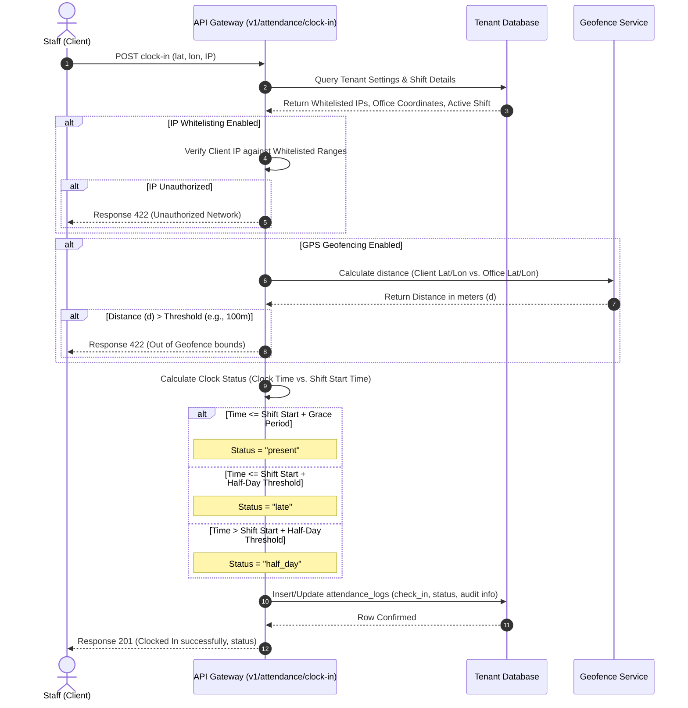
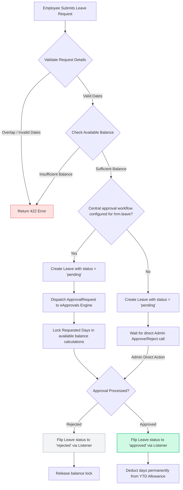
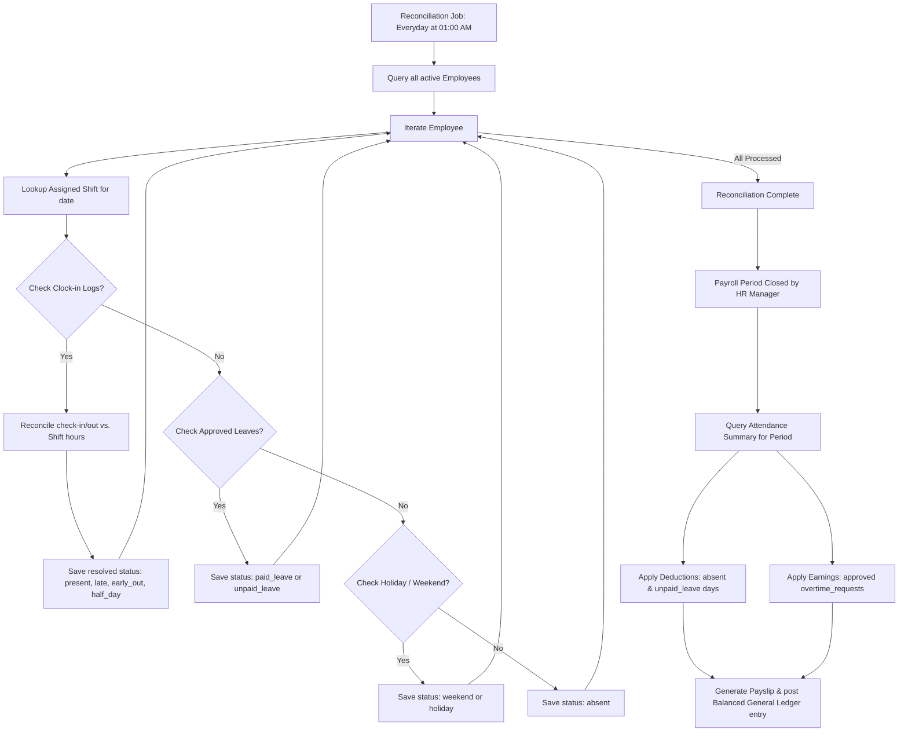

# HRM Time Off & Attendance: Workflows

This document visualizes the runtime workflows for clock-in geofencing, leave request approval routing, and daily attendance reconciliation.

---

## 1. Clock-In & Geofence Verification Flow

This workflow illustrates how the system validates a check-in request against IP Whitelists and GPS boundaries.

---

## 2. Leave Request & eApprovals Integration Flow

This diagram shows how leave requests interact with the centralized `eApprovals` engine and enforce balance checks.

---

## 3. Daily Reconciliation & Payroll Integration

This flowchart illustrates the daily processing of work schedules and how the result affects monthly payroll calculations.

