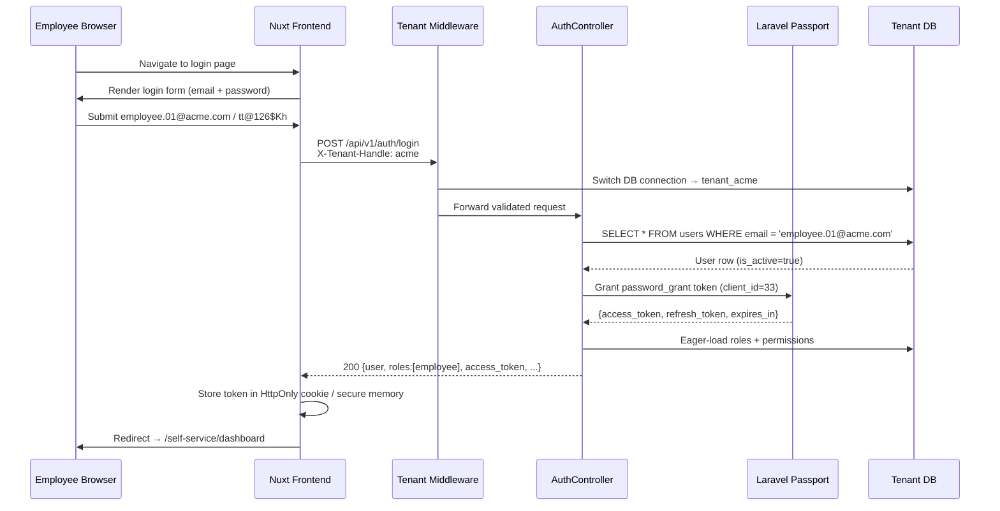
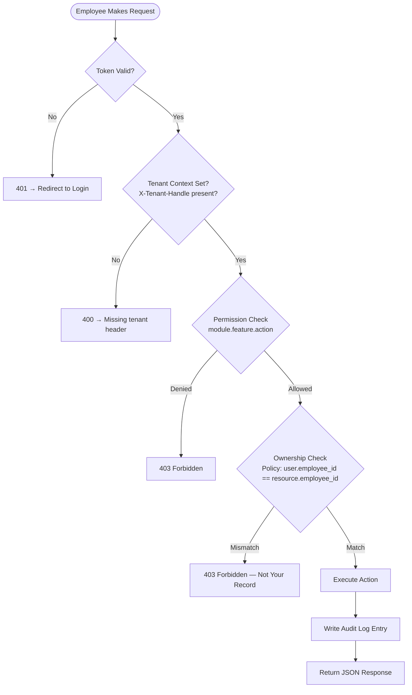
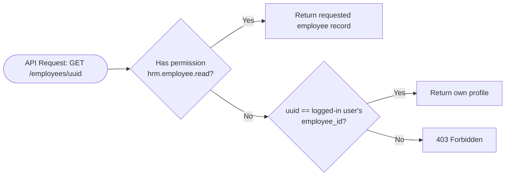
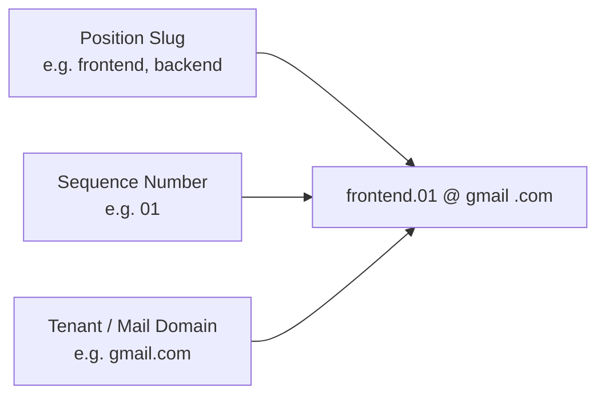

# Employee Role — Authentication & Self-Service Flow

## 1. Role-Mail Login Flow

## 2. Self-Service Resource Access Flow

## 3. Ownership Scoping Decision Tree

## 4. Role Mail Email Derivation

