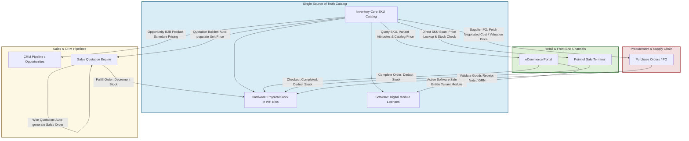
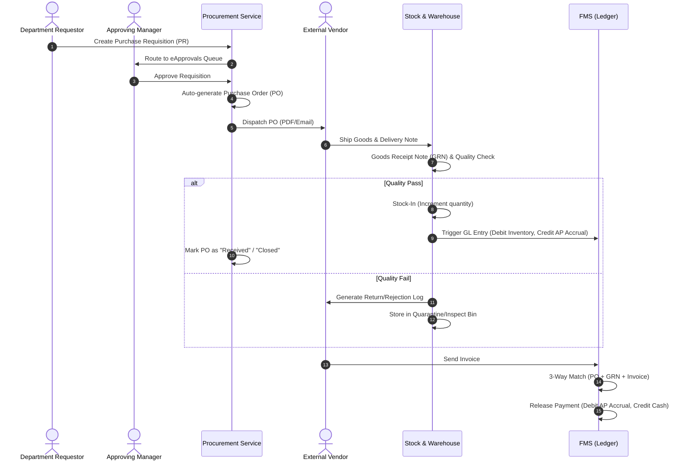
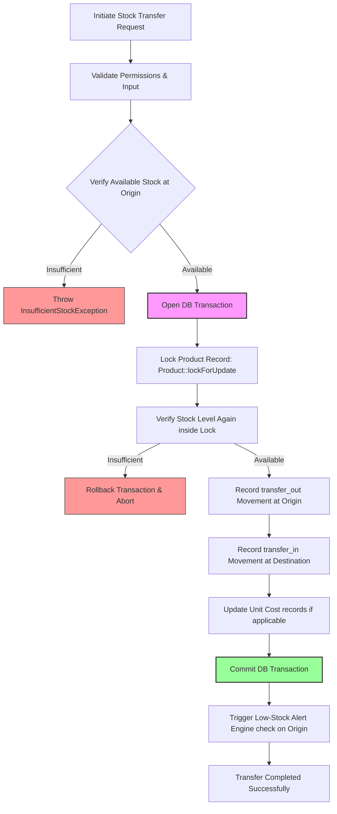
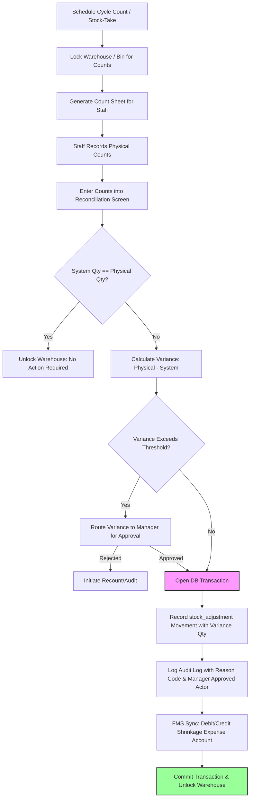
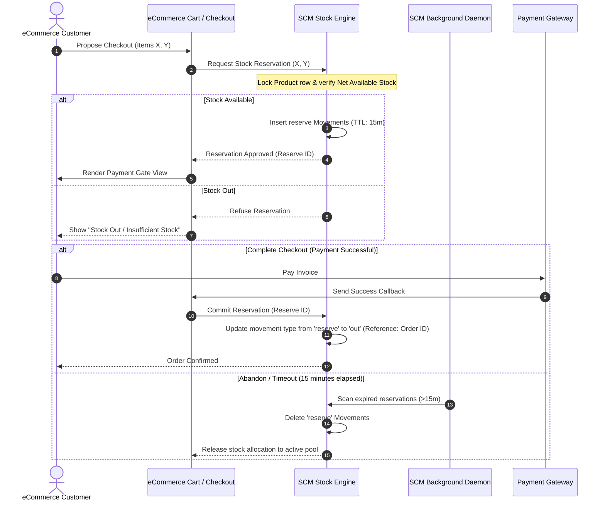

# Feature Flows: Inventory Management & SCM

## 1. Unified Product Catalog Flow (Single Source of Truth)
This flowchart shows how the Inventory Catalog serves as the absolute Single Source of Truth (SSOT) across all sales, front-end retail, CRM, and procurement channels.

---

## 2. Procure-to-Pay (P2P) Procurement Workflow
This flow maps the lifecycle of purchasing inventory from suppliers, moving from initial request through approval, shipment, quality inspection, stock-in, and final invoice matching.

---

## 3. Atomic Inter-Warehouse Stock Transfer Flow
Stock transfers between physical warehouses must be transaction-safe, locking the records and enforcing stock availability to prevent concurrent double-booking of stock.

---

## 4. Stock Take & Cycle Count Audit Flow
Periodic auditing of physical inventory against the system database ledger to perform reconciliations and log audit trail entries.

---

## 5. eCommerce Cart Reservation & Fulfillment Flow
Tracks online shopping stock reservation during checkout, TTL monitoring, automatic releases, and final conversion to sales stock-out.

