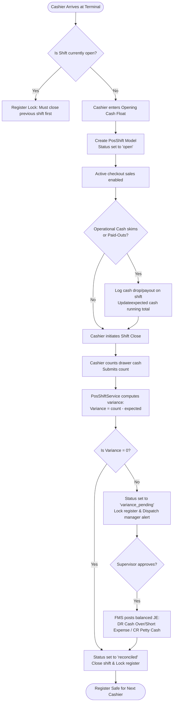
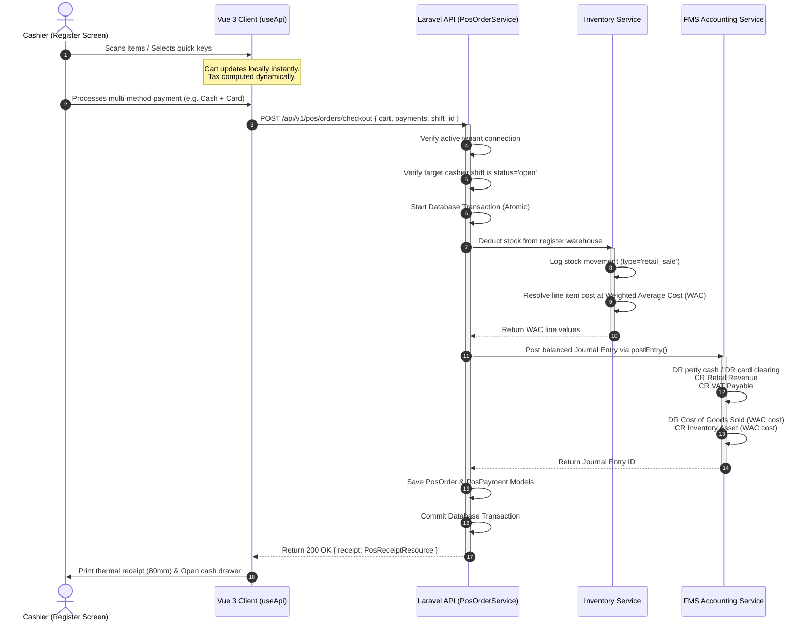
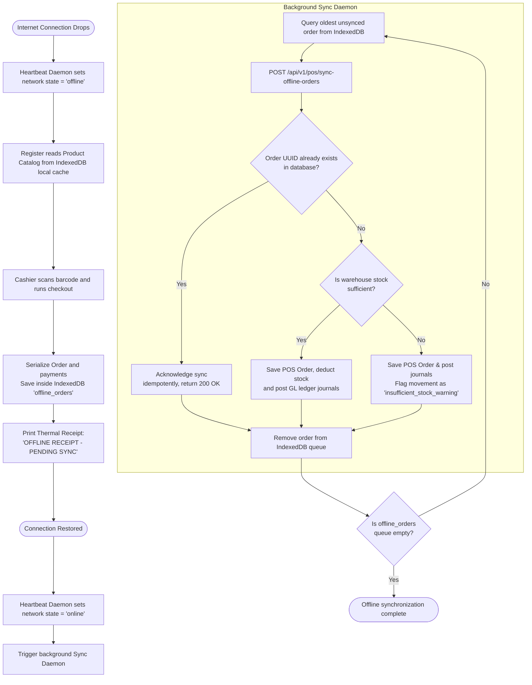

# Point of Sale Workflows

This document maps the operational cashier lifecycles, real-time sync systems, and financial posting pipelines of the Point of Sale (POS) module using visual Mermaid diagrams.

---

## 1. Cashier Shift Drawer & Variance Workflow

This flow maps the lifecycle of opening a terminal shift, recording the float, performing cash skims, and supervisor variance reconciliation.

---

## 2. Front-Counter Checkout & Stock-Out Workflow

This flowchart traces a standard, online barcode checkout transaction, showing the immediate WAC-cost stock-out calculation and integration.

---

## 3. Client-Side Offline Resiliency & Sync Daemon

This diagram illustrates the resilient offline checkout capability, client-side caching in IndexedDB, and the automated reconciliation background sync daemon when connection is recovered.

