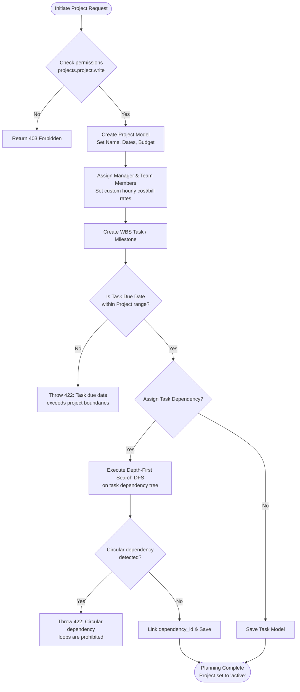
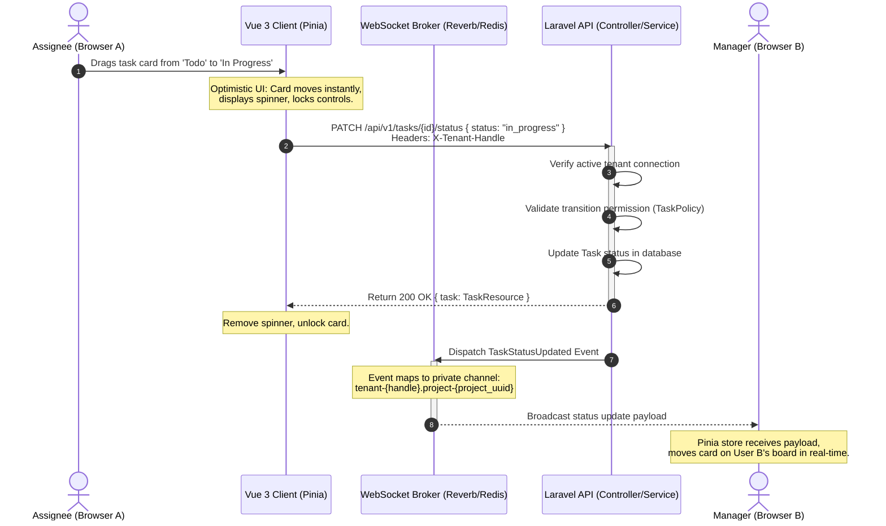
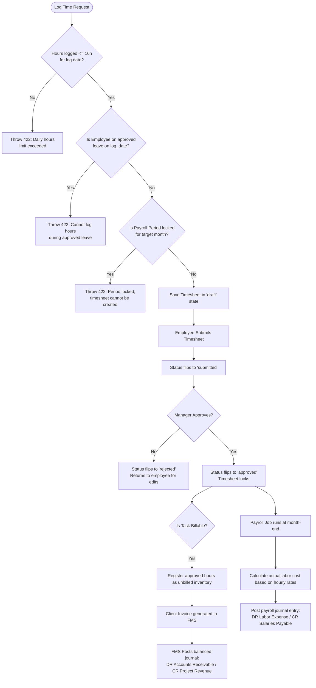
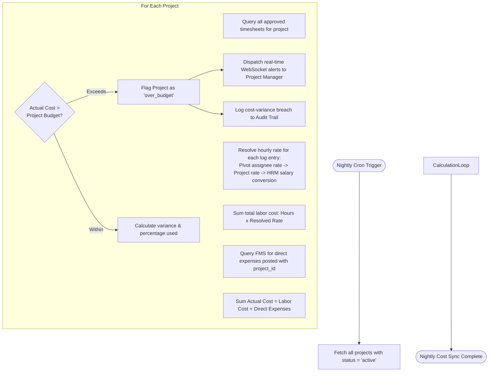

# Project Management Workflows

This document maps the operational lifecycles, real-time sync systems, and financial posting pipelines of the Project Management and Time Tracking module using visual Mermaid diagrams.

---

## 1. Project Initiation & WBS Planning Flow

This flow illustrates the sequence of setting up a project, defining the Work Breakdown Structure, assigning task dependencies, and running circular dependency validation.

---

## 2. Kanban Board & WebSockets Real-Time Sync Flow

This flowchart describes the optimistic UI updates when dragging task cards and the tenant-scoped real-time broadcasting mechanics.

---

## 3. Timesheet Logging, Validation, & Financial Integration Flow

This diagram traces the full lifecycle of an employee logging hours, the manager's approval board, and the automatic downstream integration with FMS billing and HRM payroll records.

---

## 4. Nightly Project Cost & Budget Reconciliation Flow

This flow maps the nightly automated calculation comparing planned project budgets against calculated labor costs and direct financial expenses.

