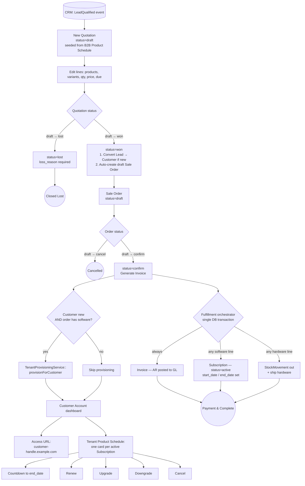
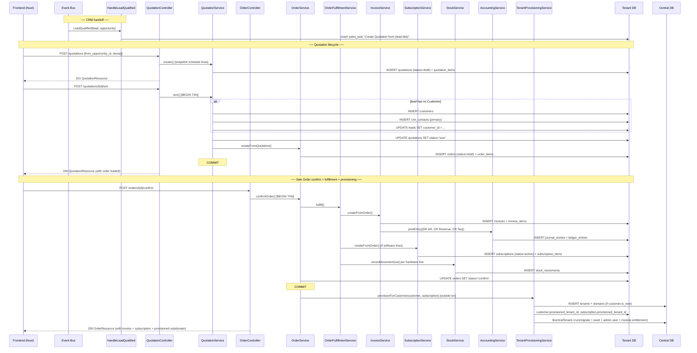

# Sales Workflow Flow (O2C — Hybrid Sales)

> Status legend: **Shipped** = matches current code today. **Planned** = target state per [`rules/hybrid_sales_business_flow.md`](../../rules/hybrid_sales_business_flow.md). Three planned shifts are documented here:
> 1. Quotation status renamed `new/confirmed/cancelled` → `draft/won/lost`. `won` performs Lead → Customer conversion.
> 2. Tenant provisioning trigger moves from `SubscriptionConfirmed` → `OrderConfirmed` (Sale Order `confirm`).
> 3. New Customer Account dashboard surface (access URL + subscription countdown + renew/upgrade/downgrade/cancel).

## Target end-to-end O2C funnel (Planned)

## Target status rules

### Quotation (Planned)

| Status | Editable | Transitions out | Side effects |
|---|---|---|---|
| `draft` | Yes | → `won`, → `lost` | Editable line items, prices, discounts, validity dates. |
| `won` | No | (terminal) | Single `DB::transaction`: convert Lead → Customer if new; create primary `CrmContact` if needed; auto-create `draft` Sale Order from snapshot. |
| `lost` | No | (terminal) | Requires non-empty `loss_reason`. Closes the originating Lead as `unqualified` (if linked). |

### Sale Order (Planned)

| Status | Editable | Allowed actions | Side effects |
|---|---|---|---|
| `draft` | Yes | confirm, cancel | Editable header/lines. |
| `confirm` | No | cancel | `OrderFulfillmentService::fulfill()` runs in the same transaction: Invoice (always), Subscription (software lines), StockMovement out (hardware lines). **Provisions tenant** if customer is new and order has software. |
| `cancel` | No | (terminal) | Reversal of a confirmed order requires credit-note (FMS) and restock (Inventory). |

### Subscription (Planned)

| Status | Editable | Allowed actions | Side effects |
|---|---|---|---|
| `active` | Header only | Renew, Upgrade, Downgrade, Cancel | Countdown to `end_date`. Renew extends `end_date` and bills a new Invoice. Upgrade/Downgrade swaps variant + bills a delta. |
| `expired` | No | Renew (creates a new subscription) | Tenant kept; module visibility reduces per policy. Reached automatically by a daily job when `end_date < today` and not renewed. |
| `cancelled` | No | (terminal) | Tenant kept; deprovisioning is a separate policy decision. |

## Backend call graph — target (Planned)

## Customer Account dashboard (Planned)

After provisioning, Sales surfaces a customer account page at `pages/sales/customers/[id]/account.vue`. Sections:

| Block | Data source | Actions |
|---|---|---|
| Access URL | `customer.tenant_handle` + `platform.system_domain` | Copy-to-clipboard, "Open in new tab" |
| Tenant Product Schedule | Customer's active `subscriptions` with eager-loaded `items` | One card per Subscription |
| Subscription countdown | `subscription.end_date - now()` | Live countdown badge (days remaining); colors: green > 30d, amber 7–30d, red < 7d |
| Renew | `POST /subscriptions/{id}/renew { cycle? }` | Extends `end_date`; bills a new Invoice |
| Upgrade | `POST /subscriptions/{id}/change-plan { product_id, variant_id, action:'upgrade' }` | Swaps variant; bills delta on next cycle or immediate |
| Downgrade | `POST /subscriptions/{id}/change-plan { product_id, variant_id, action:'downgrade' }` | Swaps variant; applies credit on next invoice |
| Cancel | `POST /subscriptions/{id}/cancel { reason }` | Sets status=`cancelled`; tenant kept per retention policy |

Buttons are disabled when the subscription is `expired` or `cancelled` (`Renew` remains enabled on `expired`).

## Atomicity boundaries (Planned)

| Boundary | Scope |
|---|---|
| `QuotationService::win` | Single `DB::transaction` for Customer-create-if-needed + CrmContact-create + Lead.customer_id update + Quotation status update + draft Order creation |
| `OrderService::confirmOrder` | Single `DB::transaction` wrapping Invoice create + Subscription create + StockMovement create + AR journal posting + order.status update |
| `TenantProvisioningService::provisionForCustomer` | Runs **after** `confirmOrder` commits. Catches exceptions → logs → surfaces on UI as "Provisioning pending — retry". Order stays `confirm`; idempotent retry available. |
| `SubscriptionService::renew` / `changePlan` / `cancel` | Each wraps its own `DB::transaction`. Renew + changePlan emit a new `Invoice` inside the same transaction. |

## Cancellation guards (Planned)

- **Quotation `draft`**: cancel becomes `lost` (loss_reason required). No `cancelled` state any more.
- **Sale Order `confirm`**: cancel sets status=`cancel`. Downstream Invoice/Subscription must be reversed individually (credit note for invoice, cancel for subscription). Hardware stock movement is not auto-reversed — operator issues a return.
- **Subscription `active`**: cancel allowed at any time. Renew/Upgrade/Downgrade pause if a cancellation is in flight.

## Central migrations (still required — unchanged)

The three central migrations for tenant provisioning remain unchanged:

| File | Purpose |
|---|---|
| `2024_01_01_000001_create_tenants_table.php` | `tenants` with `handle` as PK |
| `2024_01_01_000002_create_domains_table.php` | `domains` FK → `tenants.handle` |
| `2024_01_01_000003_use_handle_as_tenant_pk.php` | Transitions UUID-PK installs to handle-PK |

## Current shipped flow (for reference)

The implementation as of this writing differs from the target above. See [`skills/sales/rules.md` § "Shipped — current behaviour"](./rules.md) for the still-active call graph: Customer-create-on-`POST /customers`, auto-Quotation-on-`OpportunityWon`, provisioning on `SubscriptionConfirmed`.
