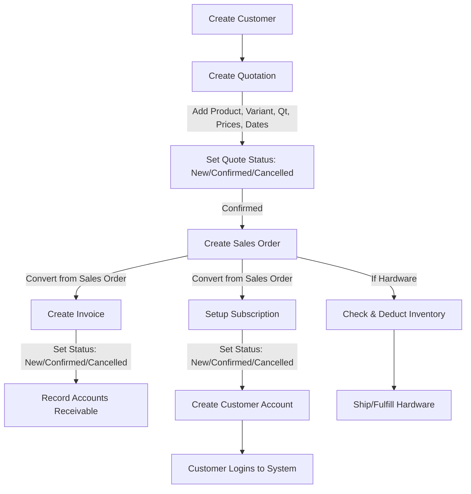

# Sales Workflow Flow (O2C)

```mermaid
graph TD
    A[Create Customer] --> B[Create Quotation]
    B -->|Add Product, Variant, Qt, Prices, Dates| C[Set Quote Status: New/Confirmed/Cancelled]
    C -- Confirmed --> D[Create Sales Order]
    
    %% Sales Order Conversion
    D -->|Convert from Sales Order| E[Create Invoice]
    D -->|Convert from Sales Order| F[Setup Subscription]
    D -->|If Hardware| G[Check & Deduct Inventory]
    
    %% Status Management
    E -->|Set Status: New/Confirmed/Cancelled| H[Record Accounts Receivable]
    F -->|Set Status: New/Confirmed/Cancelled| I[Create Customer Account]
    
    I --> J[Customer Logins to System]
    G --> K[Ship/Fulfill Hardware]
```
