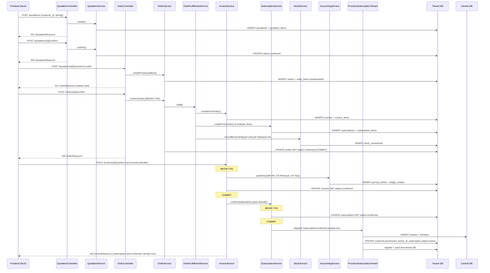

# Sales Workflow Flow (O2C — Hybrid Sales)

## Canonical funnel

```mermaid
graph TD
    Start((Start)) --> A[Create Customer]
    A --> B[Create Quotation]

    B --> B1[Add line: product + variant + qty + price + due_date]
    B1 --> C{Quote status}

    C -- new --cancel--> End1((Closed Lost))
    C -- new --confirm--> CC[Quote confirmed]
    CC -- convert --> D[Sales Order from Quote]

    D --> D1{Order status}
    D1 -- new --cancel--> End2((Cancelled))
    D1 -- new --confirm--> Split{{Fulfillment orchestrator — one DB txn}}

    Split -- always --> E[Invoice 1:1]
    Split -- if any software line --> F[Subscription 1:1]
    Split -- if any hardware line --> G[StockMovement out per line]

    E --> E1[invoice.confirm posts AR journal:<br/>DR AR  CR Revenue + CR Tax]
    E1 --> E2[auto-confirms linked Subscription if new]
    E2 --> F1
    F --> F1[subscription.confirm dispatches<br/>SubscriptionConfirmed event]
    F1 --> F2[ProvisionSubscriptionTenant listener:<br/>Central\Tenant + domain + tenant DB migrate/seed]
    F2 --> F3[Customer can access domain]
    G --> G1[Ship hardware — external process]

    E1 --> Final((Payment & Complete))
    F3 --> Final
    G1 --> Final
```

## Backend call graph



## Cancellation guards

- **Quotation**: cancellable at `new` or `confirmed` if no Sales Order exists. Once an Order exists, cancel the Order instead.
- **Order**: cancellable only while `new`. A confirmed Order has downstream artifacts — reverse individually.
- **Invoice**: cancellable only while `new`. Confirmed → posted to GL; reversal requires a credit note via FMS.
- **Subscription**: cancellable at any status; deprovisioning the customer tenant is a future concern.

## Atomicity boundaries

| Boundary | Scope |
|---|---|
| `OrderService::confirmOrder` | Single `DB::transaction` wrapping Invoice create + Subscription create + StockMovement create |
| `InvoiceService::confirm` | Inner `DB::transaction` for journal + invoice status update; subscription confirm runs after commit |
| `SubscriptionService::confirm` | Own `DB::transaction` for status update; `SubscriptionConfirmed` dispatched after commit |
| `ProvisionSubscriptionTenant::provision` | Seller-DB `DB::transaction` for `customer` + `subscription` updates; `$centralTenant->run()` is separate |

## Central migrations (required before provisioning)

The `domains` table lives in the central (landlord) database. It is created by:
- `database/migrations/central/2024_01_01_000001_create_tenants_table.php`
- `database/migrations/central/2024_01_01_000002_create_domains_table.php`

`CentralServiceProvider::boot()` calls `$this->loadMigrationsFrom(database_path('migrations/central'))` so `php artisan migrate` picks these up automatically. If the `domains` table is missing you will see:
```
SQLSTATE[42P01]: Undefined table: relation "domains" does not exist
```
Run `php artisan migrate --path=database/migrations/central --force` to recover.
